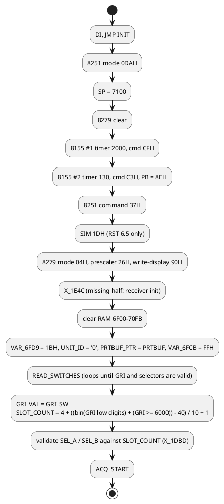
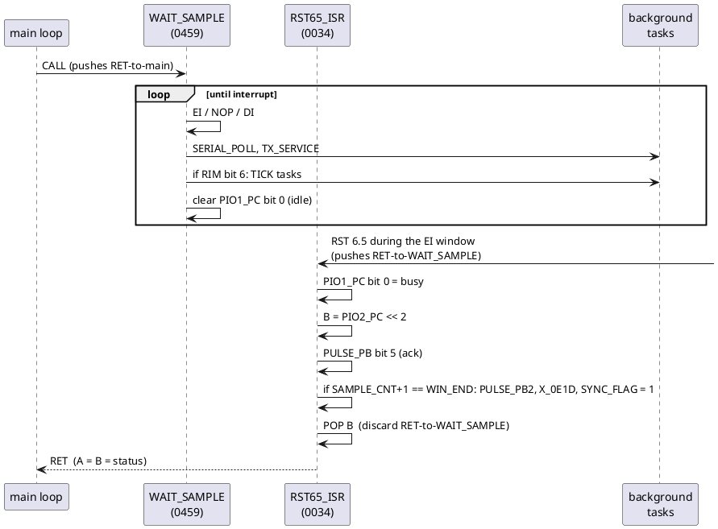
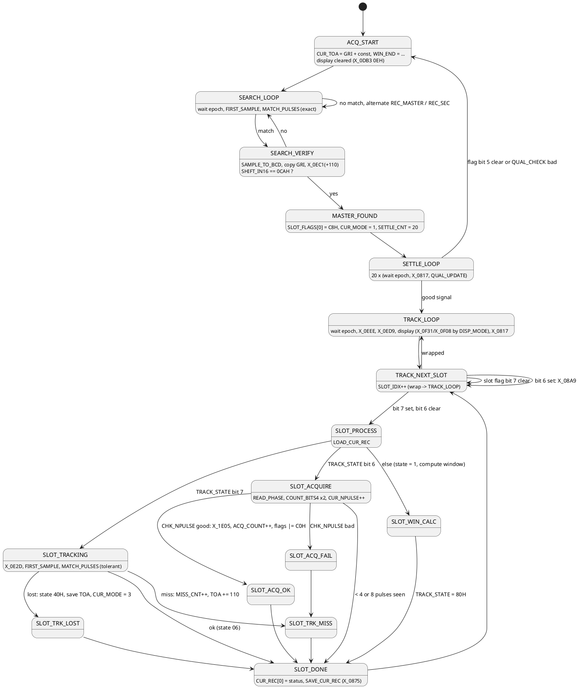

# Firmware structure

The firmware is a Loran-C receiver/navigator program. The identification rests
on three independent facts in the code:

- the byte shifted in from the receiver is compared with 0CAH and 09FH, and a
  table holds CA F9 / 9F AC. These are exactly the Loran-C phase codes
  (master GRI-A `++--+-+-`, master GRI-B `+--+++++`, secondary GRI-A
  `+++++--+`, secondary GRI-B `+-+-++--`);
- the four-digit thumbwheel value is validated to start with 4..9, the range of
  Loran-C Group Repetition Intervals (4000-9999);
- all time quantities are 4-byte packed BCD, matching the 0.1 us TD readouts of
  a Loran-C receiver, and one record per station (master + up to 4 secondaries)
  is kept.

## Boot sequence

## Interrupt-driven coroutine

The idle routine `WAIT_SAMPLE` (0459) never returns by itself. It opens a
one-instruction interrupt window, runs the background tasks, and loops. When the
receiver strobes RST 6.5 inside that window the handler pops the interrupt return
address and returns to whoever called `WAIT_SAMPLE`.

Consequences:

- Interrupts are disabled everywhere except that window, so no other code has
  to be re-entrant.
- Every `CALL WAIT_SAMPLE` in the main loop means "wait for the next sample".
- `WAIT_EPOCH` (049B) repeats `WAIT_SAMPLE` until the returned status has bit 4
  set (port C bit 2), i.e. until the start of a GRI.
- Background work (serial port, switches, report output) gets CPU time only
  between samples.

## Main program phases

The exact semantics of the window arithmetic live partly in the missing halves
(`X_0E1D`, `X_0E2D`, `X_0EC1`, `X_0ED9`, `X_0EEE`), so the phase names above are
working names, not proven ones.

## Per-slot data

`SLOT_COUNT` (5..9 depending on GRI) time slots exist per GRI. Each slot has:

| Item | Where | Notes |
|---|---|---|
| flags | `SLOT_FLAGS[slot]` (6F04..6F0D) | bit 7 active, bit 6 acquiring, bits 1..0 = index of the secondary record, bit 3/5/4 used by the report and settle logic (C8H written for the master) |
| 9-byte record | `SLOTREC_CNT + 9*slot` (6FEE..) | counter at +0, fields at +3 (`SLOTREC_3`) and +5 (`SLOTREC_5`); stride was patched from 10 to 9 (`OLD_MUL10`) |
| 1 byte | `SLOT_TBL[slot]` (7054..) | tested by the code fragment at 1000 |

Station records are 25 bytes:

| Offset | Name in `CUR_REC` copy | Contents |
|---|---|---|
| +0..+3 | `CUR_REC` | 4-byte BCD, byte 0 doubles as status (bit 0 = "skip in ISR") |
| +4..+7 | `CUR_TOA` | 4-byte BCD time of arrival / TD (GRI-relative) |
| +8 | `CUR_NPULSE` | pulse counter(s) |
| +9..+13 | `CUR_PULSES` | up to 5 sample positions where the phase code matched |
| +14..+15 | `CUR_PULSE_PTR` | write pointer into the list |
| +22 | `CUR_MODE` | 1 = settling, 3 = re-acquiring |

Record instances: `REC_MASTER` (6F24), `REC_SEC[0..3]` (6F3D, 6F56, 6F6F, 6F88),
working copy `CUR_REC` (6FA1). `LOAD_CUR_REC` / `SAVE_CUR_REC` move records in and
out of the working copy; `GET_SLOT_REC` picks the instance from the slot flags.

## Arithmetic helpers

| Routine | Function |
|---|---|
| `BCD_ADD4` / `BCD_SUB4` | 4-byte packed BCD add / ten's-complement subtract, `(BC) op= (HL)` |
| `BCD_TO_BIN` / `BIN_TO_BCD` | single byte conversions (tails in the missing half) |
| `MUL8` | 8 x 8 -> 16 shift-add multiply |
| `MUL9_INDEX` | HL + 9*A (record indexing) |
| `COUNT_BITS4`, `PHASE_MISMATCH` | popcounts used for phase-code correlation |
| `NEG_HL` | 16-bit negate |
| `COPY4`, `COPY_E`, `FILL_ZERO` | block moves |

## Background tasks (run from WAIT_SAMPLE)

| Task | Trigger | Description |
|---|---|---|
| expansion ROM hook | every pass | if byte at 2000 = 0A5H, `CALL 2001` |
| `SERIAL_POLL` | every pass | 8251 receive state machine, monitor, plot output |
| `TX_SERVICE` | every pass | drain `PRTBUF` to the 8251 when `OUT_MODE` = 0 |
| `TICK_HOOK` | RST 7.5 latched | indirect call through `TICK_HOOK` if non-zero |
| `REPORT_TASK` | RST 7.5 latched | periodic serial data report |
| `X_18C0` | RST 7.5 latched | missing half (display refresh is the likely job) |
| `TICK_TASK` | RST 7.5 latched | BCD tick counter, switch-change handling |

See [serial-protocol.md](serial-protocol.md) and [front-panel.md](front-panel.md).

## Evidence of in-place patching

Three dead fragments show the ROM was patched by hand after assembly:

| Address | Old code | What replaced it |
|---|---|---|
| 0515-051A | multiply by 10 | `MUL9_INDEX` multiply by 9 (record stride 10 -> 9) |
| 0533-053E | copy `CUR_REC` -> record | `LOAD_CUR_REC` copies record -> `CUR_REC` |
| 058C-0593 | flag manipulation on `SLOT_FLAGS` | nothing (jumped around) |

Two more idioms worth knowing when reading the source: `21H` (LXI H) is used as a
two-byte skip prefix (`TX_DASH`, `PHASE_CODE_TBL`), and `EI / NOP / DI` is the
interrupt window described above.
