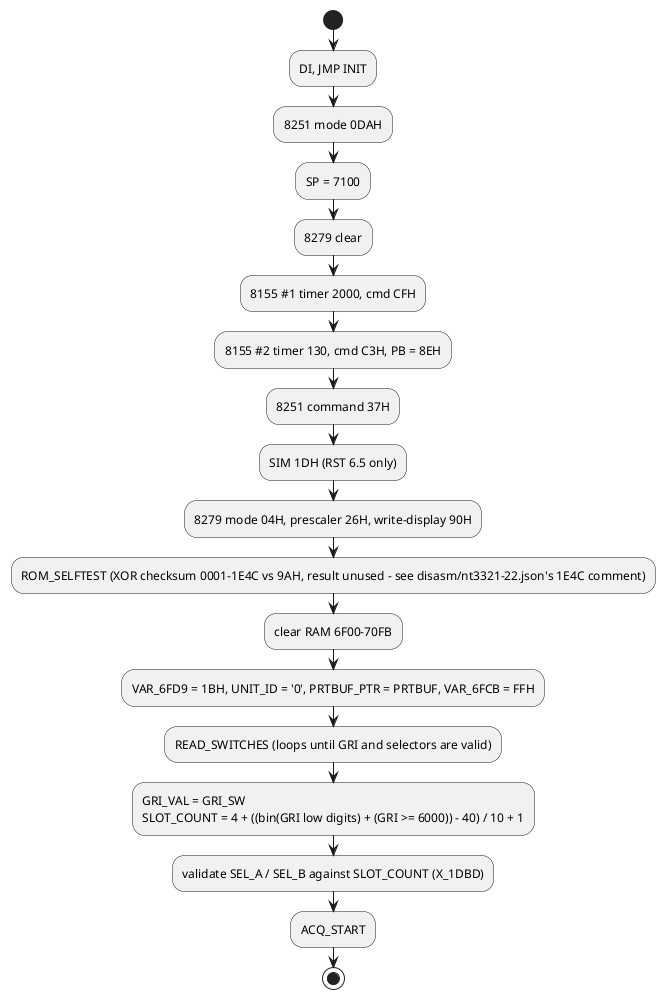
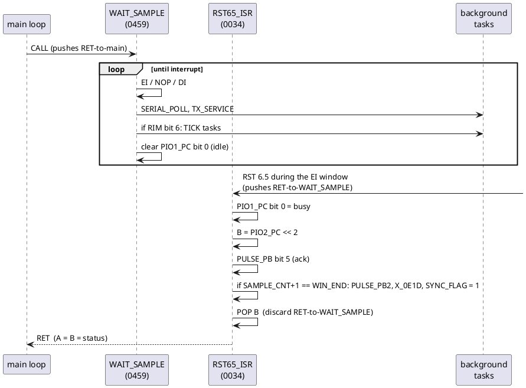
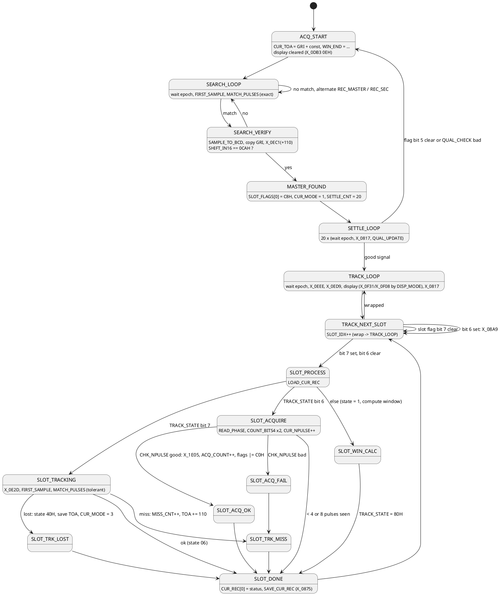

# Firmware structure

The firmware is a Loran-C receiver/navigator program. The identification rests
on three independent facts in the code:

- the byte shifted in from the receiver is compared with 0CAH and 09FH, and a
  table holds CA F9 / 9F AC. These are exactly the Loran-C phase codes
  (master GRI-A `++--+-+-`, master GRI-B `+--+++++`, secondary GRI-A
  `+++++--+`, secondary GRI-B `+-+-++--`);
- the four-digit thumbwheel value is validated to start with 4..9, the range of
  Loran-C Group Repetition Intervals (4000-9999);
- all time quantities are 4-byte packed BCD, matching the 0.1 us TD readouts of
  a Loran-C receiver, and one record per station (master + up to 4 secondaries)
  is kept.

## Boot sequence

## Interrupt-driven coroutine

The idle routine `WAIT_SAMPLE` (0459) never returns by itself. It opens a
one-instruction interrupt window, runs the background tasks, and loops. When the
receiver strobes RST 6.5 inside that window the handler pops the interrupt return
address and returns to whoever called `WAIT_SAMPLE`.

Consequences:

- Interrupts are disabled everywhere except that window, so no other code has
  to be re-entrant.
- Every `CALL WAIT_SAMPLE` in the main loop means "wait for the next sample".
- `WAIT_EPOCH` (049B) repeats `WAIT_SAMPLE` until the returned status has bit 4
  set (port C bit 2), i.e. until the start of a GRI.
- Background work (serial port, switches, report output) gets CPU time only
  between samples.

## Main program phases

The exact semantics of the window arithmetic are in routines that are present
in the fully-recovered ROM but not yet individually analyzed (`X_0E1D`,
`X_0E2D`, `X_0EC1`, `X_0ED9`, `X_0EEE` - see `docs/jump-graph.md`'s worklist,
item 1), so the phase names above are working names, not proven ones.

## Per-slot data

`SLOT_COUNT` (5..9 depending on GRI) time slots exist per GRI. Each slot has:

| Item | Where | Notes |
|---|---|---|
| flags | `SLOT_FLAGS[slot]` (6F04..6F0D) | bit 7 active, bit 6 acquiring, bits 1..0 = index of the secondary record, bit 3/5/4 used by the report and settle logic (C8H written for the master) |
| 9-byte record | `SLOTREC_CNT + 9*slot` (6FEE..) | counter at +0, fields at +3 (`SLOTREC_3`) and +5 (`SLOTREC_5`); indexed by `MUL9_INDEX` |
| 1 byte | `SLOT_TBL[slot]` (7054..) | tested by the code fragment at 1000 |

Station records are 25 bytes:

| Offset | Name in `CUR_REC` copy | Contents |
|---|---|---|
| +0..+3 | `CUR_REC` | 4-byte BCD, byte 0 doubles as status (bit 0 = "skip in ISR") |
| +4..+7 | `CUR_TOA` | 4-byte BCD time of arrival / TD (GRI-relative) |
| +8 | `CUR_NPULSE` | pulse counter(s) |
| +9..+13 | `CUR_PULSES` | up to 5 sample positions where the phase code matched |
| +14..+15 | `CUR_PULSE_PTR` | write pointer into the list |
| +22 | `CUR_MODE` | 1 = settling, 3 = re-acquiring |

Record instances: `REC_MASTER` (6F24), `REC_SEC[0..3]` (6F3D, 6F56, 6F6F, 6F88),
working copy `CUR_REC` (6FA1). `LOAD_CUR_REC` / `SAVE_CUR_REC` move records in and
out of the working copy; `GET_SLOT_REC` picks the instance from the slot flags.

## Arithmetic helpers

| Routine | Function |
|---|---|
| `BCD_ADD4` / `BCD_SUB4` | 4-byte packed BCD add / ten's-complement subtract, `(BC) op= (HL)` |
| `BCD_TO_BIN` / `BIN_TO_BCD` | single byte conversions (short tails at 0800 and in `HI_NIBBLE`) |
| `MUL8` | 8 x 8 -> 16 shift-add multiply |
| `MUL9_INDEX` | HL + 9*A (record indexing) |
| `COUNT_BITS4`, `PHASE_MISMATCH` | popcounts used for phase-code correlation |
| `NEG_HL` | 16-bit negate |
| `COPY4`, `COPY_E`, `FILL_ZERO` | block moves |

## Background tasks (run from WAIT_SAMPLE)

| Task | Trigger | Description |
|---|---|---|
| expansion ROM hook | every pass | if byte at 2000 = 0A5H, `CALL 2001` |
| `SERIAL_POLL` | every pass | 8251 receive state machine, monitor, plot output |
| `TX_SERVICE` | every pass | drain `PRTBUF` to the 8251 when `OUT_MODE` = 0 |
| `TICK_HOOK` | RST 7.5 latched | indirect call through `TICK_HOOK` if non-zero |
| `REPORT_TASK` | RST 7.5 latched | periodic serial data report |
| `TICK_CLOCK_CASCADE` | RST 7.5 latched | not display refresh (the old guess) - a cascading BCD tick clock, see below |
| `TICK_TASK` | RST 7.5 latched | BCD tick counter, switch-change handling |

See [serial-protocol.md](serial-protocol.md) and [front-panel.md](front-panel.md).

## Print-buffer formatting cluster (186D-19E7)

Fully decoded this session (previously all generically named `SUB_`/`X_`).
`PRTBUF_PUT` (186D) appends one character to `PRTBUF`; everything else in this
cluster builds on it to format bytes as ASCII hex/BCD digits:

| Routine | Input | Output | Notes |
|---|---|---|---|
| `NIBBLE_TO_HEX` (18B4) | low nibble of A | A = ASCII char | `'0'`-`'9'`, `'A'`-`'F'` |
| `BYTE_TO_HEX2` (18AA) | A = byte | A = lo char, B = hi char | falls into `NIBBLE_TO_HEX` |
| `PRT_HEX_BYTE` (1878) | HL -> byte | 2 chars to `PRTBUF`, HL-- | lo char first, then hi |
| `PRT_HEX_HI_SP` (189B) | HL -> byte | `' '` + hi char, HL-- | single-digit field |
| `PRT_TD_DOT` (1885) | HL -> byte | `' '` + lo + `'.'` + hi, HL-- | decimal point mid-byte |
| `RPT_FMT_TD3` (1804) | HL -> 3 bytes | `PRT_TD_DOT` then `PRT_HEX_BYTE` x2 | one TD-style report field |
| `PRT_HEX_BYTE_A` (197A) | A = byte | 2 chars to `PRTBUF` | no HL, operates on A directly |
| `PRT_DIGIT_LO` (1984) | A = byte | 1 char (low nibble) | for values that are already 0-9 |
| `RPT_HEADER_LINE` (1940) | - | CR/LF + status digit + fields | last `REPORT_TASK` item |

`REPORT_TASK` reaches `RPT_FMT_TD3` two ways: for item 0 with `HL=GRI_BCD_HI`
(the GRI report field), and for other items via `RPT_ITEM_OFS`'s
`MUL10_INDEX` call into a 10-byte-stride table at 7056H, falling straight
through into `RPT_FMT_TD3`.

## Switch-validation error display (1990-19B7)

`READ_SWITCHES` calls one of six stubs when a thumbwheel fails validation -
confirmed by tracing every call site, not just inferred from names:

| Stub | Field | Confirmed by |
|---|---|---|
| `SW_ERR_SEL_A` (1990) | selector A out of range | only caller is before `STA SEL_A` |
| `SW_ERR_SEL_B` (1995) | selector B out of range | only caller is before `STA SEL_B` |
| `SW_ERR_GRI1` (199A) | GRI digit 1 invalid or not 4-9 | two call sites, both guard digit 1 |
| `SW_ERR_GRI2` (199F) | GRI digit 2 invalid | |
| `SW_ERR_GRI3` (19A4) | GRI digit 3 invalid | |
| `SW_ERR_GRI4` (19A9) | GRI digit 4 invalid (blank is allowed) | |

All six do `MVI B,<field 1..6> / JMP SW_ERR_SHOW`. `SW_ERR_SHOW` (19B8) fills
both display rows with `ERR_DASH_TBL`'s dash pattern, then BCD-stamps the
field number into the middle digit of each row before falling into the
display-commit path at `L_1CEA` - i.e. it shows "field N is bad" as dashes
with the field number in the middle, on both display rows. Two more stubs for
field numbers 7 and 8 exist right after (`X_19AE`, `X_19B3`) but are dead:
only 6 fields are ever validated.

## `TICK_CLOCK_CASCADE` (18C0)

Runs once every `TICK_BCD` wraparound (background task, RST 7.5 latched).
Cascades a BCD add-and-carry through `VAR_704F` (mod 60H) -> `SW_LO` (mod 60H)
-> `SW_HI` (mod 24H), i.e. an HH:MM:SS-shaped clock. If `STATUS_BITS` bit 7 is
clear, it also cascades a second HH:MM:SS-shaped clock through `VAR_70BD` ->
`VAR_7050` -> `VAR_7051`. This was previously guessed to be the display
refresh driver; it is not. It is **not yet reconciled** with `SW_LO`/`SW_HI`/
`VAR_704F`'s other documented role as latched thumbwheel values during set-up
(see front-panel.md) - either these RAM cells are genuinely dual-purpose
(set-up latch vs. run-mode clock digit) or one of the two readings needs
revisiting; settling it needs the physical unit's actual display behavior.

## Evidence of in-place patching

Dead fragments show the ROM was patched by hand after assembly in some spots:

| Address | Old code | What replaced it |
|---|---|---|
| 0533-053E | copy `CUR_REC` -> record | `LOAD_CUR_REC` copies record -> `CUR_REC` |
| 058C-0593 | flag manipulation on `SLOT_FLAGS` | nothing (jumped around) |
| 1E1C-1E22 | shorter entry into what's now `SUB_1E23` | `SUB_1E23` inserts an extra `MOV A,C` / `STA SLOT_IDX` step |
| 1F80-1FFF | four old routine bodies (see `disasm/nt3321-22.json`'s `1F80` comment) | reorganized/relocated equivalents elsewhere in ROM 1 |

**Correction:** 0515-051A (`0515`, once labeled `OLD_MUL10`) was wrongly filed
here. A stale forced-`db` override in the hints file was hiding it as data even
though it is live code with 11 real callers - it's `MUL10_INDEX`, a genuine
sibling of `MUL9_INDEX` for 10-byte-stride tables (`M_7053`, `M_7057`, the
7056H report-item table), unrelated to the 9-byte `SLOTREC_CNT` records. There
was no patch here; the "dead code" claim was simply an error in the original
analysis, caught by noticing its xref list was all `CALL`-kind (live) rather
than `LXI`-kind (pointer-only) references.

Two more idioms worth knowing when reading the source: `21H` (LXI H) is used as a
two-byte skip prefix (`TX_DASH`, `PHASE_CODE_TBL`), and `EI / NOP / DI` is the
interrupt window described above.
