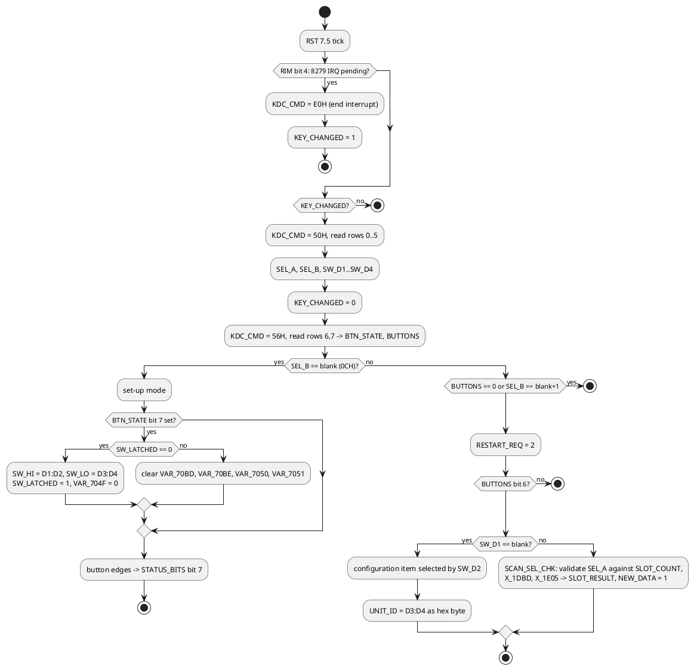

# Front panel: switches and display (8279 at D000/D001)

The 8279 runs in **encoded-scan sensor-matrix** mode. Its eight scan lines and
eight return lines form a 64-point matrix that the chip samples continuously
into an 8-byte sensor RAM. Any change raises IRQ (wired to RST 5.5). The
firmware reads the sensor RAM rather than a key FIFO, so the "keyboard" is a set
of switches, not keys.

## Sensor matrix layout

| Sensor row | Bits used | Function | Firmware variable |
|---|---|---|---|
| 0 | 0..5 | selector A: secondary station for readout A | `SEL_A` (digit + 1) |
| 1 | 0..5 | selector B: secondary station for readout B | `SEL_B` (digit + 1) |
| 2 | 0..5 | GRI digit 1 (must be 4..9) | `SW_D1` |
| 3 | 0..5 | GRI digit 2 | `SW_D2` |
| 4 | 0..5 | GRI digit 3 | `SW_D3` |
| 5 | 0..5 | GRI digit 4 (blank allowed = 0) | `SW_D4` |
| 6 | 7, 6 | push button(s): bit 7 toggles `BTN_STATE` bit 7 on each press; bit 6 -> `BUTTONS` bit 7 | `BTN_STATE`, `BUTTONS` |
| 7 | 7, 6 | push button(s): bit 7 -> `BTN_STATE` bit 6; bit 6 -> `BUTTONS` bit 6 | |

### Thumbwheel code

`SW_TO_DIGIT` (14B5) converts a row byte:

```
digit = 9 - (row AND 3FH)      valid when (row AND 3FH) <= 9   -> carry set
otherwise                       returns 0BH ("blank" position)  -> carry clear
```

So each wheel is a 10-position (or 12-position) switch whose common is a scan
line and whose outputs are wired to return lines 0..5, producing the 9's
complement of the dialled digit in binary. A blank/unused position reads as
0BH after conversion.

`READ_SWITCHES` at power-up insists on valid settings: selector wheels must read
0..8 (stored as 1..9), the first GRI digit must be 4..9, digits 2..4 may be 0..9
and digit 4 may also be blank (taken as 0). Any violation calls one of six error
stubs in the missing ROM half (`X_1990`..`X_19A9`, most likely "show error code
1..6 on the display") and re-reads.

## Run-time switch handling



### Configuration items (GRI digit 1 = blank, press button)

| GRI digit 2 | Effect |
|---|---|
| 0 | 110 baud (8155 #2 timer 1418) |
| 1 | 300 baud (timer 520) |
| 2 | 1200 baud (timer 130) |
| 3 | 19200 baud (timer 8) |
| 4 | `OPTIONS` = 00H |
| 5 | `OPTIONS` = 81H |
| 6 | `OPTIONS` = 82H |
| 7 | `OPTIONS` = 84H |
| 8 | `OPTIONS` = 88H |
| 9 | `OPTIONS` = 80H |

In every case GRI digits 3 and 4 are also latched into `UNIT_ID` as a hex byte
(for example wheels 3,0 give `'0'`, 4,1 give `'A'`). `OPTIONS` gates the
periodic serial report, see [serial-protocol.md](serial-protocol.md).

## Display

`DISP_REFRESH` (13E7, reached only from the missing half) writes seven bytes of
8279 display RAM with auto-increment from address 0:

| Display byte | High nibble (OUTA) | Low nibble (OUTB) |
|---|---|---|
| 0 | 7034 high digit | 7037 high digit |
| 1 | 7034 low digit | 7037 low digit |
| 2 | 7035 high digit | 7038 high digit |
| 3 | 7035 low digit | 7038 low digit |
| 4 | 7036 high digit | 7039 high digit |
| 5 | 7036 low digit | 7039 low digit |
| 6 | 703A (both nibbles) | |

Reading: OUTA drives a six-digit row showing the packed-BCD number at
7034..7036, OUTB drives a second six-digit row showing 7037..7039, and display
position 6 provides two extra digits or indicators. That matches a classic
two-line Loran-C TD readout (TD-A over TD-B, five digits plus tenths each).

Display codes 0EH and 0FH are passed to the display routines `X_0DB3` and
`X_0D79` in the missing half; on 7447/7448-style decoders these codes produce
partial-segment and blank patterns, which is consistent with "clear display"
during acquisition.

## Not yet known

- Which physical control is which row (needs the board or a photo).
- The function of the button edges recorded in `STATUS_BITS`.
- Whether display byte 6 carries station letters, a lock indicator, or the GRI.
