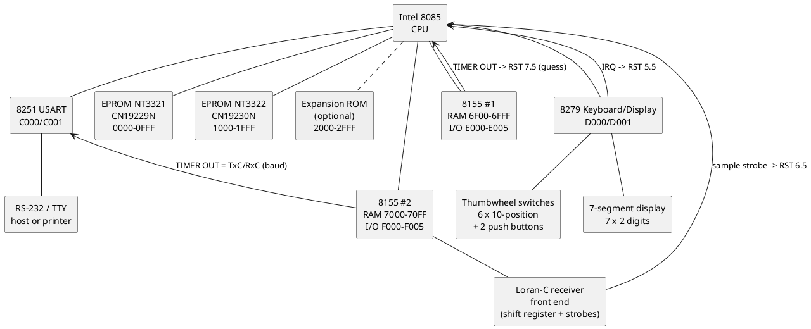
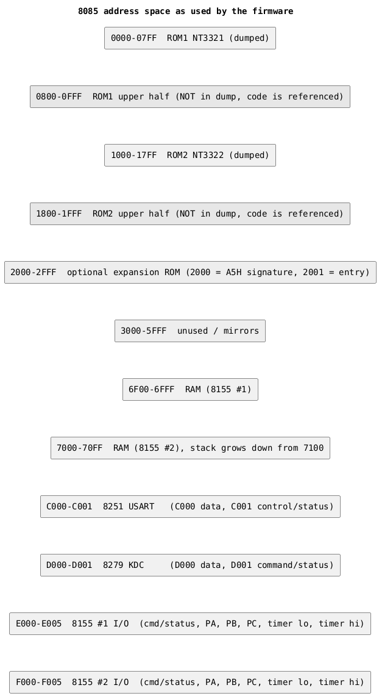

# Hardware reconstruction (from firmware analysis)

Everything below is inferred from the two ROM images (now fully recovered -
see [rom-status.md](rom-status.md)). Nothing has been verified against a
board yet. Items marked **(inferred)** are strong deductions from the code;
items marked **(guess)** are plausible but need confirmation from the
hardware, or from analyzing the ROM's still-generically-named routines
further (see [jump-graph.md](jump-graph.md)'s worklist).

## System overview

## Chip inventory

| Device | Evidence | Confidence |
|---|---|---|
| Intel 8085 CPU | `RIM`/`SIM` instructions, RST 5.5/6.5/7.5 handling, reset vector at 0000 | certain |
| 2 x 2732-class 4 KB EPROM (labels CN19229N / CN19230N, date code 7943) | image size, contiguous code across 07FF/0800 | see [rom-status.md](rom-status.md) |
| Intel 8251A USART at C000/C001 | mode byte 0DAH then command 37H, status bits 0/1 polled as TxRDY/RxRDY | certain |
| Intel 8279 keyboard/display controller at D000/D001 | command sequence CDH (clear), 04H (sensor matrix), 26H (prescaler), 90H (write display), 50H/56H (read sensor RAM), E0H (end interrupt) | certain |
| Intel 8155 #1, I/O at E000-E005 | 6-register footprint, command CFH, timer loaded via E004/E005 | certain |
| Intel 8155 #2, I/O at F000-F005 | 6-register footprint, command C3H, timer reloaded with baud-rate divisors | certain |
| 512 bytes RAM total, 6F00-70FF | INIT clears exactly 6F00-6FFF and 7000-70FB; SP = 7100; two 8155s supply 2 x 256 bytes | inferred |
| Optional expansion ROM at 2000 | `LDA 2000 / CPI A5H / CZ 2001` in the idle loop | certain (hook exists) |

No `IN`/`OUT` instructions appear anywhere. All peripherals are memory mapped.

## Memory map

### Address decoding **(inferred)**

The pattern fits a single 3-to-8 decoder on A14..A12 with A15 routed to the
8155 IO/M pins:

| A14..A12 | A15 = 0 (memory) | A15 = 1 (I/O side of 8155) |
|---|---|---|
| 000 | ROM1 0000-0FFF | mirror |
| 001 | ROM2 1000-1FFF | mirror |
| 010 | expansion ROM 2000-2FFF | mirror |
| 011 | unused | unused |
| 100 | (8251 mirror) | 8251 at C000 |
| 101 | (8279 mirror) | 8279 at D000 |
| 110 | 8155 #1 RAM (256 B, mirrored in 6000-6FFF) | 8155 #1 registers at E000 |
| 111 | 8155 #2 RAM (256 B, mirrored in 7000-7FFF) | 8155 #2 registers at F000 |

This explains why the firmware places its RAM at 6F00 and 7000: the last page of
the first 8155's range and the first page of the second's are contiguous, giving
one 512-byte block with the stack at the top. Whether A15 also gates the ROM and
peripheral selects cannot be told from software.

The emulator ([docs/emulator.md](emulator.md)) implements exactly this table as
a standalone decoder component, modeled as an emulated PAL16R8/20R10 with
matching CUPL source rather than as the 8205 + TTL glue actually on this
board - see [docs/pal-decoder.md](pal-decoder.md) for that design and why it
doesn't change anything documented here about the physical decoder.

## Peripheral programming

### 8251A USART (C000 data, C001 control)

| Write | Value | Meaning |
|---|---|---|
| mode | 0DAH | asynchronous, x16 clock, 7 data bits, parity enabled, odd parity, 2 stop bits |
| command | 37H | TxEN, DTR, RxE, error reset, RTS |

Status bit 0 (TxRDY) and bit 1 (RxRDY) are polled; interrupts are not used for
the USART. Frame: **7 data, odd parity, 2 stop** (7O2).

The receive/transmit clock comes from 8155 #2's timer output **(inferred)**: the
set-up mode reloads that timer with four divisors, and four divisors only make
sense as a baud-rate table.

| 8155 #2 timer count | Baud at CLK 2.5 MHz | Baud at CLK 2.4576 MHz | Nominal |
|---|---|---|---|
| 1418 (058AH) | 110.2 | 108.3 | 110 |
| 520 (0208H) | 300.5 | 295.4 | 300 |
| 130 (0082H) default | 1201.9 | 1181.5 | 1200 |
| 8 (0008H) | 19531 | 19200 | 19200 |

Baud = CLK / (16 x count). A 5.000 MHz crystal (CLK 2.5 MHz) fits the three low
rates within 0.2 %; a 4.9152 MHz crystal fits 19200 exactly. Either is
plausible; 5 MHz is the better overall fit. Default after reset is 1200 baud.

### 8279 keyboard/display controller (D000 data, D001 command/status)

| Command | Value | Meaning |
|---|---|---|
| clear | 0CDH | clear display RAM (to all ones) and FIFO/sensor RAM |
| mode | 04H | 8 x 8-bit display, left entry; **encoded scan, sensor matrix** keyboard mode |
| prescaler | 26H | clock prescaler 6 (implies a ~600 kHz clock into the 8279, e.g. CLK/4) |
| write display | 90H | write display RAM, auto-increment, address 0 |
| read sensor | 50H / 56H | read sensor RAM from row 0 / row 6, auto-increment |
| end interrupt | 0E0H | clear the sensor-change IRQ |

Sensor matrix mode means the "keyboard" is a set of switches wired straight into
the 8 x 8 return-line matrix, not a scanned keypad. Rows 0..5 are 10-position
thumbwheels (see [front-panel.md](front-panel.md)); rows 6 and 7 carry two
momentary push buttons on bits 7 and 6. The 8279 IRQ output drives **RST 5.5**
(inferred from the End-Interrupt command being issued when RIM shows 5.5 pending).

Display RAM is written as 7 bytes. Each byte carries two 4-bit digit codes (the
8279 OUTA/OUTB nibbles), so the display is two rows of 6 digits plus one extra
byte, most likely through BCD-to-seven-segment decoders (7-segment LED is the
standard, cheap choice for a numeric instrument readout from this era - the
board's date code, 7943, is week 43 of 1979, and BCD-to-7-segment decoder/
drivers like the 7447/7448/4511 were the default part for exactly this job at
the time; VFD and LCD numeric displays existed but were less common and would
usually show up as a different decoder family, and nothing in the code hints
at either). Treated as the working conclusion for open question 4 below -
not board-confirmed, and can't be: the display/keypad panel itself (as
opposed to the processor board, which was photographed - see "Physical board
observations") is a separate physical unit this project doesn't have access
to, so there is no meter check or chip-silkscreen photo available to settle
it beyond this code- and era-based inference.

**Correction:** this section previously claimed codes 0EH/0FH were passed to
"display routines" `X_0DB3`/`X_0D79` and would give "blank"-like patterns on
a 7447-class decoder. That guess didn't survive decoding the actual bytes:
those routines (now `INIT_REC_FROM_TOA`/`INIT_REC_AND_SEND`) take 0EH/0FH as
a `CUR_REC` status-byte value while seeding a station record from `CUR_TOA`,
and never touch the 8279 or display RAM at all. See `docs/front-panel.md`'s
own correction and `docs/jump-graph.md` for current names. Which routines
actually drive the display's blank/clear pattern is still open.

### 8155 #1 (I/O at E000)

| Register | Value | Meaning |
|---|---|---|
| E000 command | 0CFH | PA out, PB out, PC out (ALT2), timer start |
| E004/E005 timer | 07D0H, mode 01 | count 2000, continuous square wave |
| E003 port C | bit 0 | set when the CPU starts work, cleared in the idle loop: **busy indicator / watchdog strobe** |

The timer runs at CLK/2000 (1250 Hz at 2.5 MHz). Its output is the most likely
source of the periodic **RST 7.5** tick **(guess)**.

**Correction:** this table previously said ports A and B of this chip were
"never touched by the dumped halves" - that was true only before the second
EPROM was recovered. They are written, from `REC_TO_FRONTEND` (was `X_0DE6`;
`CUR_REC_TO_FRONTEND`, was `X_0DE3`, is a thin wrapper into it; 0800-0FFF,
called from `SEARCH_LOOP`/`SETTLE_LOOP`/`TRACK_LOOP`): bytes 1-3 of the
current record's 4-byte BCD value (`CUR_REC`+1..+3) are copied out to
`PIO1_PB` (E002), `PIO1_PA` (E001) and `PIO2_PA` (F001) in sequence,
immediately after `PIO2_PB`'s low bits are updated from `CUR_REC`'s status
byte. `REC_TO_FRONTEND` is now fully decoded (see its
`disasm/nt3321-22.json` comment and `docs/jump-graph.md`'s call-flow
diagrams) - it's called at every station-selection transition, and again
once per epoch via `FIND_NEXT_TRACK_SLOT`/`LATCH_REC_TO_PIO2PB`, which stage
the *next* slot's record ahead of time and commit it precisely at the RST
6.5 window-end capture. That two-stage timing is strong evidence this is a
deliberate feed-forward output - candidates for *why* are an analog/parallel
output for an external recorder (there's a silkscreened `SAMPLER` section and
a `TRF` connector on the board, see the photo-derived notes below) or some
other board beyond this one reading the current TD value in binary rather
than over the serial link - still not confirmed, but no longer just a
one-off write with no traced caller. This also means `PIO2_PB` bits 0, 1, 3
(previously "static, meaning unknown") are not static - they carry
`CUR_REC`'s status-byte bits 0, 1, 3.

### 8155 #2 (I/O at F000)

| Register | Value | Meaning |
|---|---|---|
| F000 command | 0C3H | PA out, PB out, PC input (ALT1), timer start |
| F004/F005 timer | 0082H, mode 01 | baud-rate generator, see above |
| F002 port B | idle 8EH | control lines to the receiver front end |
| F003 port C | input | status and serial data from the receiver front end |

Port B bit usage:

| Bit | Idle | Use |
|---|---|---|
| 2 | 1 | pulsed (`PULSE_PB2`) at INIT, around the window-end capture in the ISR, and in tracking. Likely a counter latch/reset strobe. |
| 4 | 0 | pulsed 8 times per `SHIFT_IN16`: shift clock for the receiver's serial data |
| 5 | 0 | pulsed after every RST 6.5 sample: sample acknowledge |
| 0, 1, 3 | - | **not static** (correction, see 8155 #1 section above): set by `REC_TO_FRONTEND` from `CUR_REC`'s status-byte bits 0, 1, 3 during search/settle/track |
| 6, 7 | 0, 1 | static, meaning unknown |

Port C bit usage (as read in `SHIFT_IN16` and the ISR):

| Bit | Use |
|---|---|
| 2 | epoch flag: `WAIT_EPOCH` waits for a sample with this bit set (start of GRI) |
| 3 | serial data stream 2 (shifted into C) |
| 4 | serial data stream 1 (shifted into B): the 8-pulse phase-code word |
| 5, 4 | rotated into bits 7, 6 by the ISR and handed to the main loop |

Port A of 8155 #2 is not referenced by the dumped halves.

## Interrupts

| Input | Vector | Use |
|---|---|---|
| TRAP | 0024 | not used (vector falls inside `PULSE_PB`), must be tied low |
| RST 5.5 | 002C | masked; polled via RIM bit 4. Driven by the 8279 IRQ (switch change). |
| RST 6.5 | 0034 | **enabled**. Receiver sample strobe. Handler is a coroutine exit, see [firmware.md](firmware.md). |
| RST 7.5 | 003C | masked; edge-latched and polled via RIM bit 6, cleared with `SIM 10H`. Periodic tick. |
| INTR | - | not used |

`SIM 1DH` at INIT: MSE = 1, M7.5 = 1, M6.5 = 0, M5.5 = 1, R7.5 = 1.

## Receiver front end (what the software expects)

The dumped code never sees raw RF. It sees:

- one strobe per sample (RST 6.5), with two status bits on port C;
- a serial shift register clocked by port B bit 4 delivering two 8-bit words per
  sample: the sign pattern of the 8 pulses in a group (compared against the
  Loran-C phase codes 0CAH/09FH for master, 0F9H/0ACH for secondaries) and a
  second word whose meaning is not yet clear;
- an acknowledge pulse (port B bit 5) after each sample and a latch/reset pulse
  (port B bit 2) at window boundaries.

So the analog board does hard-limiting, cycle/envelope detection and pulse-group
timing; the 8085 does phase-code correlation, station search, tracking and TD
arithmetic in packed BCD.

## Open questions for the hardware owner

1. ~~Crystal frequency~~ - **effectively resolved.** The user confirms only one
   crystal/oscillator can is visible on the board: the 10.000 MHz TCXO
   documented below. The 8085 divides its XTAL input by 2 internally to form
   CLK, so a 10 MHz can feeding X1/X2 directly gives exactly **5.000 MHz**,
   which independently matches the baud-rate divisor table's "better overall
   fit" already derived from the code. Not yet meter-confirmed that the can
   connects straight to U40's X1/X2 pins rather than through a divider - see
   the physical-verification checklist below - but no evidence points to a
   second, different-frequency source anymore.
2. What drives RST 7.5 (8155 timer out is the guess; U22 or U35, see below).
3. What the 8279 (U36) CLK is fed from (prescaler 6 implies about 600 kHz).
4. Whether the display uses BCD-to-7-segment decoders on OUTA/OUTB - treated
   as the working conclusion (see the Display section above) but not
   physically confirmable: the display/keypad panel is a separate unit this
   project doesn't have access to.
5. ~~The EPROM type~~ - resolved, see [rom-status.md](rom-status.md): Intel 8332
   masked ROMs.
6. ~~The address decoder~~ - **resolved.** The user confirms U45 is an 8205
   (1-of-8 decoder) - exactly the "single 3-to-8 decoder on A14..A12" the
   address-decoding table above already inferred from software behavior
   alone. Which decoder output feeds which chip select is still worth a
   continuity check (see the checklist below) but the decoder's existence
   and type are now hardware-confirmed, not just inferred.

## Physical board observations (photographed, not yet fully cross-traced)

Everything above this section was inferred purely from the ROM contents. The
board itself has since been photographed; this section adds what's visible
there. None of it has been traced with a meter against the schematic above -
treat it as corroborating context, not verified fact, until someone confirms
continuity.

**Identification.** Silkscreened `NAVTEC CORP. NASHUA, N.H.`, board number
`983733-1 ATC20`, labeled `PROCESSOR/FRONT PANEL`. This is one board in a
larger Navtec Loran-C receiver system (consistent with `EXTROM_SIG`/expansion
ROM hook in the code - there is more system than this one board).

**Confirms the 8279 identification above.** The chip at what the silkscreen
calls the display/keyboard position reads `D8279-5`, `INTEL '77` - matches the
"certain" 8279 identification from the command-byte evidence exactly. (An
earlier photo read of a *different* chip on this board was misidentified as
"8275" - Intel's CRT controller, a different part entirely - almost certainly
just a misread of similar-looking silkscreen; the 8279 command-byte evidence
in this document is the reliable identification.)

**Answer to open question 1 (crystal frequency) - see resolution above.**
There's a precision oscillator can on the board: `MICROSONICS, WEYMOUTH
MASS., MODEL TX8A/099, FREQ 10.000 MHz, SET AT 25°C`, silkscreened `PROCESSOR
BOARD OSC/TP` right next to it - a TCXO (temperature-compensated), which fits
a Loran-C timing reference better than an ordinary CPU clock crystal would.
The user confirms it's the *only* crystal/oscillator visible on the board, so
it's the sole clock source rather than one of several: either it feeds the
8085 (U40) directly - the 8085's internal /2 turns 10 MHz into exactly
5.000 MHz CLK, matching the baud-rate table's preferred fit - or it feeds a
divider chain (there are several 74-series counter/divider ICs across the top
of the board) that produces 5 MHz for the CPU alongside other derived rates
for the receiver sample clock and/or the 8279's CLK (open question 3). Which
of those two it is is exactly item 1 on the physical-verification checklist
below.

**Chip designators**, from the user's read of the board silkscreen (not yet
cross-checked against the schematic beyond matching the chip-inventory table
above):

| Designator | Part | Matches |
|---|---|---|
| U22 | 8155 | one of the two RAM/IO chips (E000 or F000 - which is which isn't determined by designator alone, see checklist) |
| U35 | 8155 | the other one |
| U32 | 8251A | USART (C000) |
| U36 | 8279 | keyboard/display controller (D000), matches the `D8279-5` silkscreen read above |
| U40 | 8085 | CPU |
| U45 | 8205 | 1-of-8 decoder - confirms open question 6 above |
| U39 | 8212 | 8-bit I/O latch |

**U39 conflict, unresolved:** the "other chips" note below (from an earlier
photo pass) placed the unpopulated `OPTION` ROM sockets "near U29 and U39,"
but U39 is now identified as the 8212 chip itself, not a socket next to it.
Either the earlier "near U39" read was an approximation (the sockets are near
the 8212 but not literally at that reference designator) or one of the two
U39 reads is wrong - worth a second look at the board rather than assuming
either is right.

**New hardware not visible from the code alone: RS-422/485 differential line
receiver.** An `AM26LS32DC` (quad differential line receiver) sits near a
silkscreened `COMM` section, close to a connector labeled `P5 IO/TLS`. The
diagram above shows the 8251A USART going to a generic "RS-232/TTY host or
printer" - the real physical link is more specifically RS-422/485-style
differential signaling, which naturally supports the multi-drop bus topology
[serial-protocol.md](serial-protocol.md) already describes from the code side.
This is corroboration, not new capability: the software evidence and the
hardware evidence agree on "multi-drop," they just each explain a different
half of it.

**Silkscreened functional sections**, for whoever traces this next: `SAMPLER`
(near the front-end/receiver logic - matches the "receiver front end" section
above), `SYNCRONIZER` [sic], `COMM` (see above), `READOUT` (connector `J1` -
almost certainly the display, matching the 8279/`DISP` block), `PWR/DIM`
(connector `P4` - display brightness/power, matching the dimming behavior
already inferred from the code), `IO/TLS` (connector `P5`), `TRF` (connector
`P7`, near the oscillator - "time reference frequency" would fit).

**Other chips present, not yet connected to the code analysis:** an `8212`
(8-bit I/O latch, now identified as U39 - see the designator table above) and
two unpopulated 24-pin sockets silkscreened `OPTION` (references near U29 and
U39, on either side of the main ROM sockets - see the U39 conflict note
above) plus an 8-pin header `J8 OPTION`. These are plausible physical
implementations of the `EXTROM_SIG`/expansion-ROM hook already identified in
the code (see the chip inventory table above), but which physical socket
corresponds to `2000-2FFF` in the memory map hasn't been confirmed.

## Physical-verification checklist

Concrete things worth checking on the board (not the display/keypad panel,
which this project doesn't have - see open question 4). Roughly in priority
order; each ties back to an open question above.

1. **Crystal path (question 1).** With power off, trace continuity from the
   10 MHz TCXO can's output pin to U40 (8085) pins 1/2 (X1/X2). If it lands
   there directly, CLK is 5.000 MHz via the 8085's internal /2 and question 1
   is fully closed. If it instead goes into one of the 74-series
   counter/divider ICs first, trace that chip's output to X1/X2 instead and
   note the division ratio - the baud-rate table in this doc predicts 5 MHz
   at the CPU either way, so a divider would mean the TCXO runs faster than
   10 MHz effectively multiplied down, or the divider serves the *receiver*
   sample clock instead and the direct connection to U40 is still the answer.
2. **RST 7.5 source (question 2).** Trace U22 and U35 (the two 8155s) TOUT
   (timer output) pins - does either connect to U40's RST 7.5 input (pin 7)?
   The code sets one 8155's timer to a continuous square wave at INIT
   (`0CFH` command, count `07D0H` = 2000, mode 01) with its ports otherwise
   untouched by software, which is the profile expected for "this one drives
   an interrupt no software ever programs the edge/level of," rather than a
   general I/O chip - if either 8155's TOUT reaches RST 7.5, this is
   effectively confirmed; if neither does, it's back to genuinely open.
3. **Which 8155 is which (needed for #2 and general confidence).** Trace U22
   and U35's IO/M and chip-select pins back to U45 (the 8205 decoder) to
   determine which one answers at `E000` (8155 #1, RAM `6F00`) vs `F000`
   (8155 #2, RAM `7000`) per the address-decoding table above.
4. **8205 (U45) output mapping (question 6, to fully close it).** Trace each
   of U45's 8 outputs to confirm the predicted mapping: ROM1 (`0000`), ROM2
   (`1000`), expansion ROM (`2000`), unused (`3000`), 8251A/U32 (`C000`),
   8279/U36 (`D000`), 8155/U22 (`E000`), 8155/U35 (`F000`) - or whichever of
   U22/U35 is which per #3.
5. **8279 (U36) CLK pin (question 3).** Trace what feeds it - the TCXO
   directly, a divider output, or something else. Prescaler 6 in the code
   implies the firmware expects roughly 600 kHz there.
6. **U39 designator conflict.** Confirm by eye whether the unpopulated
   `OPTION` ROM sockets are genuinely adjacent to U39 (the 8212) or whether
   the board's actual silkscreen designator for those sockets is something
   else that was misread as "U39" in an earlier pass.
7. **Which `OPTION` socket (if either) is wired to `2000-2FFF`.** Trace
   address lines A12-A15 and the relevant 8205 output to whichever of the two
   `OPTION` sockets would be the expansion ROM the code's `EXTROM_SIG` hook
   expects.
8. **8212 (U39) purpose.** Trace what it latches and where its output goes -
   not connected to any code analysis yet; could be status lamps, the
   `OPTION` ROM's data bus buffer, or something on the `J1`/`P4`/`P5`/`P7`
   connectors.
9. **J1 `READOUT` connector pinout.** Even without the display panel itself,
   tracing which 8279 pins (OUTA/OUTB nibbles, scan lines) reach which `J1`
   pins would help confirm the two-row BCD display theory (open question 4)
   and give a head start whenever the panel is available.
