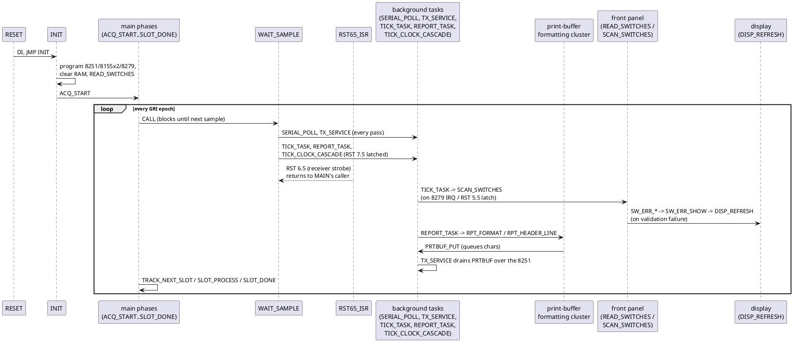
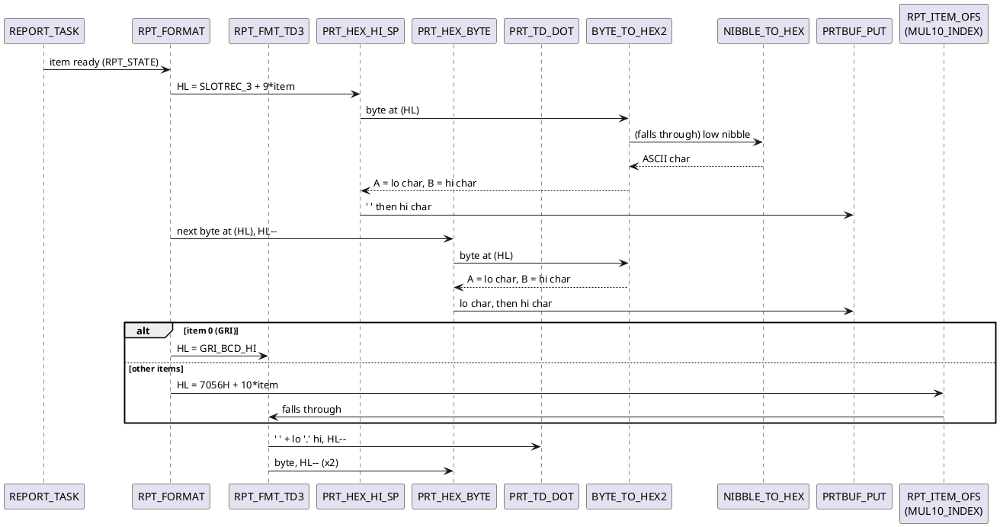
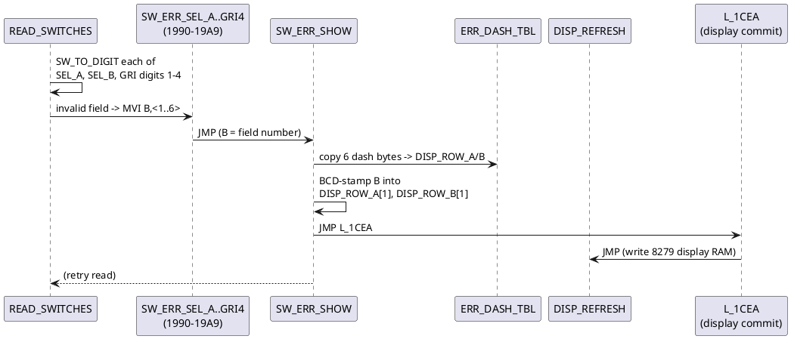

# Jump graph and analysis worklist

A call/jump graph for an 8-bit program with hundreds of labels doesn't fit
legibly in one diagram, and PlantUML sequence diagrams model *temporal
message passing between participants*, not arbitrary control flow (loops and
conditional branches need `loop`/`alt` blocks, and a flat list of 350 labels
as "participants" would be unreadable regardless). So this document takes a
different shape than a single mega-diagram:

- **Sequence diagrams** at the *subsystem* level (a handful of participants,
  each a named routine or cluster), for the parts of the firmware that are
  now fully understood. These are the useful "jump graph" views.
- **Two flat tables**, generated from `disasm/nt3321-22-refs.md`, listing
  *every* jump target that is ever `CALL`ed and *every* RAM/IO address the
  code touches, each flagged `named` or `needs analysis`. This is the
  worklist: `needs analysis` is exactly the set of generic `SUB_xxxx`/`X_xxxx`
  labels and `M_xxxx` variables that haven't been individually traced yet.
- A **prioritized list** of what to tackle next, grouped by region so a
  session can pick up one cluster at a time instead of jumping around.

Regenerate the two tables after any renaming pass with:
`node tools/dis8085.js disasm/nt3321-22.json` then re-run the extraction
script described at the bottom of this file (it's not checked in - it's a
nine-line `node -e` one-liner over `nt3321-22-refs.md`).

## System overview (sequence diagram)



This is the top-level shape of every other diagram in `firmware.md`,
`serial-protocol.md` and `front-panel.md` - see those for the detail inside
each participant above.

## Print-buffer formatting cluster (fully decoded this session)



## Switch-validation error display (fully decoded this session)



## Jump targets (all 137 `CALL`ed addresses)

Generated from `disasm/nt3321-22-refs.md`'s "Subroutines (call targets)"
table. "Callers" is the number of distinct `CALL` sites. This intentionally
excludes pure jump-only targets (`JMP`/`JZ`/... with no `CALL`) - there are
many dozens of those (loop labels, dispatch tails) and most are mechanical
control flow inside an already-named routine, not independent things to name.

| Addr | Name | Callers | Status |
|---|---|---|---|
| 001C | `PULSE_PB2` | 3 | named |
| 001E | `PULSE_PB` | 5 | named |
| 0028 | `CPY_GRI_TO_TOA` | 3 | named |
| 002B | `CPY4_TO_TOA` | 3 | named |
| 0412 | `QUAL_UPDATE` | 1 | named |
| 0445 | `QUAL_CHECK` | 1 | named |
| 0459 | `WAIT_SAMPLE` | 8 | named |
| 049B | `WAIT_EPOCH` | 4 | named |
| 04AE | `SHIFT_IN16` | 3 | named |
| 04D1 | `READ_PHASE` | 2 | named |
| 04E1 | `GET_SLOT_FLAGS` | 3 | named |
| 04E4 | `GET_FLAGS_A` | 14 | named |
| 04EB | `GET_SLOT_REC` | 1 | named |
| 04EE | `GET_ITEM_REC` | 2 | named |
| 04F7 | `GET_SEC_REC` | 2 | named |
| 04FD | `GET_SEC_TOA` | 1 | named |
| 050B | `MUL9_INDEX` | 8 | named |
| 0515 | `MUL10_INDEX` | 11 | named |
| 0522 | `LOAD_CUR_REC` | 3 | named |
| 053F | `LOAD_REC_HL` | 1 | named |
| 0545 | `BIT_OF_STA` | 1 | named |
| 0553 | `COUNT_TRACKED` | 1 | named |
| 055E | `SEC_TOA_TO_BIN` | 2 | named |
| 0561 | `TOA_TO_BIN` | 3 | named |
| 0576 | `BCD_INC_STORE` | 1 | named |
| 057A | `RESET_PULSES` | 4 | named |
| 0584 | `CLEAR_PULSES` | 4 | named |
| 058C | `PHASE_AB_SELECT` | 1 | named |
| 059D | `PHASE_MISMATCH` | 2 | named |
| 05AF | `FIRST_SAMPLE` | 2 | named |
| 05C2 | `MATCH_PULSES` | 2 | named |
| 0665 | `SAMPLE_TO_BCD` | 1 | named |
| 0671 | `COUNT_BITS4` | 2 | named |
| 067F | `CHK_NPULSE` | 2 | named |
| 0698 | `ADJ_PULSES` | 2 | named |
| 0721 | `NEG_HL` | 5 | named |
| 072A | `CALC_TD` | 4 | named |
| 0782 | `BCD_ADD4` | 7 | named |
| 0794 | `PTR_TO_MSB` | 2 | named |
| 079F | `BCD_SUB4` | 3 | named |
| 07BB | `COPY4` | 9 | named |
| 07BD | `COPY_E` | 1 | named |
| 07C6 | `MUL8` | 1 | named |
| 07D9 | `BCD_TO_BIN` | 4 | named |
| 07EF | `BIN_TO_BCD` | 4 | named |
| 0805 | `TOA1_SLOT_NIB` | 2 | named |
| 0808 | `HI_NIBBLE` | 1 | named |
| 080F | `FILL_ZERO` | 5 | named |
| 0817 | `EPOCH_PHASE_UPDATE` | 2 | named |
| 0875 | `SAVE_CUR_REC` | 1 | named |
| 08A9 | `HANDLE_ACQUIRING_SLOT` | 1 | named |
| 08F1 | `SLOT_STALE_CHECK` | 1 | named |
| 091B | `ACCUM_SLOT_TOA` | 1 | named |
| 0B07 | `PULSE_SCORE_UPDATE` | 2 | named |
| 0B8D | `CLAMP_HL_BC` | 4 | named |
| 0BB5 | `POPCOUNT_ADJ_HL` | 3 | named |
| 0BC5 | `PHASE_QUALITY_UPDATE` | 1 | named |
| 0CA4 | `SET_QUAL_FLAGS` | 1 | named |
| 0CBE | `MASTER_CORR_ADJ` | 1 | named |
| 0CE8 | `MASTER_CORR_ADD_3000` | 1 | named |
| 0D79 | `INIT_REC_AND_SEND` | 1 | named |
| 0D7F | `SAVE_REC_SYNC` | 1 | named |
| 0DB0 | `SEED_REC_STATUS` | 1 | named |
| 0DB3 | `INIT_REC_FROM_TOA` | 4 | named |
| 0DE3 | `CUR_REC_TO_FRONTEND` | 1 | named |
| 0DE6 | `REC_TO_FRONTEND` | 2 | named |
| 0E1A | `PREP_NEXT_SLOT_FRONTEND` | 3 | named |
| 0E1D | `LATCH_REC_TO_PIO2PB` | 2 | named |
| 0E2D | `FIND_NEXT_TRACK_SLOT` | 2 | named |
| 0E6A | `PULSE_ALIGN_ADJ_6FBE` | 1 | named |
| 0E6D | `PULSE_ALIGN_ADJ` | 1 | named |
| 0E87 | `PULSE_ALIGN_ADJ2` | 2 | named |
| 0E92 | `PULSE_ALIGN_ADJ2_AND_CLEAR` | 1 | named |
| 0E95 | `CLEAR_TRACK_VARS` | 1 | named |
| 0EA3 | `TOA_SUB_1000` | 3 | named |
| 0EA6 | `TOA_SUB_CONST` | 2 | named |
| 0EAC | `TOA_SUB_2000` | 1 | named |
| 0EB2 | `TOA_SUB_3000` | 2 | named |
| 0EBE | `TOA_ADD_1000` | 3 | named |
| 0EC1 | `TOA_ADD_CONST` | 5 | named |
| 0ECD | `TOA_ADD_3000` | 1 | named |
| 0ED3 | `TOA_ADD_6000` | 1 | named |
| 0ED9 | `TICK_DISP_AND_RESTART` | 3 | named |
| 0EEE | `APPLY_NEW_DATA` | 1 | named |
| 0F08 | `ACTIVATE_SELECTED_SLOT` | 1 | named |
| 0F23 | `SET_SLOT_ACTIVE` | 1 | named |
| 0F31 | `MASTER_SEC_PULSE_HANDOFF` | 1 | named |
| 0FE9 | `RESET_REC_TAIL` | 1 | named |
| 1028 | `SLOTREC_PHASE` | 1 | named |
| 105C | `SLOTREC_UPDATE` | 2 | named |
| 10DB | `CALL_TICK_HOOK` | 1 | named |
| 10DF | `SERIAL_POLL` | 1 | named |
| 1238 | `MON_GO` | 1 | named |
| 1358 | `PLOT_OUT` | 1 | named |
| 13AB | `PLOT_VALUES` | 1 | named |
| 141F | `READ_SWITCHES` | 1 | named |
| 14B5 | `SW_TO_DIGIT` | 12 | named |
| 14C9 | `TICK_TASK` | 1 | named |
| 16E0 | `TX_SERVICE` | 1 | named |
| 1708 | `PRTBUF_GET` | 1 | named |
| 1723 | `REPORT_TASK` | 1 | named |
| 186D | `PRTBUF_PUT` | 12 | named |
| 1878 | `PRT_HEX_BYTE` | 3 | named |
| 1885 | `PRT_TD_DOT` | 1 | named |
| 189B | `PRT_HEX_HI_SP` | 1 | named |
| 18AA | `BYTE_TO_HEX2` | 5 | named |
| 18B4 | `NIBBLE_TO_HEX` | 1 | named |
| 18C0 | `TICK_CLOCK_CASCADE` | 1 | named |
| 197A | `PRT_HEX_BYTE_A` | 2 | named |
| 1984 | `PRT_DIGIT_LO` | 3 | named |
| 1990 | `SW_ERR_SEL_A` | 1 | named |
| 1995 | `SW_ERR_SEL_B` | 1 | named |
| 199A | `SW_ERR_GRI1` | 2 | named |
| 199F | `SW_ERR_GRI2` | 1 | named |
| 19A4 | `SW_ERR_GRI3` | 1 | named |
| 19A9 | `SW_ERR_GRI4` | 1 | named |
| 19E7 | `DISP_TEST_TICK` | 1 | named |
| 1C3F | `CHECK_SEL_RANGE` | 4 | named |
| 1CF3 | `COMMIT_DISP_ROWS` | 1 | named |
| 1D10 | `APPLY_DISP_BLINK` | 1 | named |
| 1D45 | `BLINK_ROW_BLANK` | 2 | named |
| 1DBD | `QUEUE_SLOT_SEL` | 3 | named |
| 1E05 | `DEQUEUE_SLOT_SEL` | 3 | named |
| 1E23 | `SWAP_SLOT_IDX` | 1 | named |
| 1E4C | `ROM_SELFTEST` | 1 | named |
| 1E4F | `ROM_SELFTEST_2` | 1 | named |
| 1E52 | `ROM_SELFTEST_3` | 1 | named |
| 1E55 | `ROM_SELFTEST_BODY` | 1 | named |
| 1E9B | `SELECT_INCDEC` | 1 | named |
| 1EAA | `SHR4_ROUND` | 2 | named |
| 1EBB | `SHL4_EHL` | 1 | named |
| 1ECF | `LOAD3_BC` | 3 | named |
| 1ED9 | `BCD_COMPL_HL` | 1 | named |
| 1EED | `BCD_COMPL_ADD_DEHL` | 1 | named |
| 1F0E | `SWAP_HL_STASH` | 1 | named |
| 1F20 | `SLOT0_SNAPSHOT_TOA` | 1 | named |
| 2001 | `EXTROM_ENTRY` | 1 | named |

**0 of 137 still need analysis** - every `CALL`ed address in the ROM now has
a real name (down from 77 at the start of this session). A handful are
explicitly flagged as low-confidence in their `disasm/nt3321-22.json`
comment rather than fully proven (`SLOT_STATE_DISPATCH`, the `1E9B-1F20` BCD
cluster) - see "What to tackle next" below for what's still genuinely open,
now reframed as confidence-raising rather than first-pass naming.

## Variables (all 175 referenced RAM/IO addresses)

Generated from `disasm/nt3321-22-refs.md`'s "External memory references"
table. R/W/LXI are reference counts (reads, writes, address-load-only refs).

| Addr | Name | R | W | LXI | Status |
|---|---|---|---|---|---|
| 2000 | `EXTROM_SIG` | 1 | 0 | 0 | named |
| 2002 | `TAG_2002` | 0 | 0 | 1 | named |
| 2010 | `TAG_2010` | 0 | 0 | 1 | named |
| 6F00 | `RAM1_BASE` | 1 | 0 | 2 | named |
| 6F01 | `ACQ_COUNT` | 2 | 0 | 1 | named |
| 6F02 | `FIRST_SLOT` | 5 | 2 | 1 | named |
| 6F03 | `SLOT_RESULT` | 1 | 2 | 0 | named |
| 6F04 | `SLOT_FLAGS` | 5 | 1 | 8 | named |
| 6F0E | `WIN_END` | 0 | 4 | 4 | named |
| 6F0F | `TRACK_MASK` | 2 | 0 | 1 | named |
| 6F11 | `SLOT_IDX` | 22 | 1 | 1 | named |
| 6F12 | `SLOT_IDX_B` | 1 | 1 | 0 | named |
| 6F13 | `TRACK_STATE` | 2 | 4 | 2 | named |
| 6F14 | `SLOT_COUNT` | 1 | 1 | 4 | named |
| 6F15 | `SAMPLE_CNT` | 6 | 4 | 2 | named |
| 6F16 | `SAMPLE_LO` | 1 | 0 | 1 | named |
| 6F17 | `SYNC_FLAG` | 1 | 1 | 0 | named |
| 6F18 | `GRI_TMP` | 0 | 0 | 2 | named |
| 6F19 | `GRI_TMP_VAL` | 0 | 1 | 0 | named |
| 6F1C | `GRI_BCD` | 0 | 0 | 6 | named |
| 6F1D | `GRI_VAL` | 1 | 1 | 1 | named |
| 6F1F | `GRI_BCD_HI` | 0 | 0 | 1 | named |
| 6F20 | `BCD_ACC` | 0 | 0 | 5 | named |
| 6F23 | `BCD_ACC_HI` | 0 | 0 | 1 | named |
| 6F24 | `REC_MASTER` | 4 | 0 | 8 | named |
| 6F28 | `REC_MASTER_4` | 0 | 0 | 1 | named |
| 6F2D | `REC_MASTER_9` | 0 | 0 | 1 | named |
| 6F36 | `REC_MASTER_18` | 1 | 0 | 0 | named |
| 6F38 | `REC_MASTER_14` | 0 | 0 | 1 | named |
| 6F3A | `REC_MASTER_16` | 0 | 1 | 0 | named |
| 6F3D | `REC_SEC` | 0 | 0 | 3 | named |
| 6F41 | `REC_SEC_TOA` | 0 | 0 | 1 | named |
| 6F46 | `REC_SEC_9` | 0 | 0 | 1 | named |
| 6F51 | `REC_SEC_14` | 0 | 0 | 1 | named |
| 6F54 | `SETTLE_CNT` | 0 | 1 | 1 | named |
| 6FA1 | `CUR_REC` | 11 | 4 | 10 | named |
| 6FA5 | `CUR_TOA` | 0 | 0 | 11 | named |
| 6FA6 | `CUR_TOA_1` | 2 | 1 | 0 | named |
| 6FA8 | `CUR_TOA_3` | 1 | 0 | 0 | named |
| 6FA9 | `CUR_NPULSE` | 5 | 3 | 7 | named |
| 6FAA | `CUR_PULSES` | 0 | 0 | 7 | named |
| 6FAB | `CUR_PULSES_1` | 2 | 2 | 0 | named |
| 6FAD | `CUR_PULSES_3` | 1 | 2 | 0 | named |
| 6FAF | `CUR_PULSE_PTR` | 2 | 4 | 1 | named |
| 6FB0 | `PHASE_QUAL_UPDATE_CNT` | 0 | 0 | 1 | named |
| 6FB1 | `QUAL_STREAK_DIV5` | 0 | 0 | 1 | named |
| 6FB2 | `MATCH_SCORE_HI` | 0 | 3 | 1 | named |
| 6FB3 | `QUAL_STREAK_CNT` | 3 | 1 | 0 | named |
| 6FB5 | `PHASE_QUAL_A` | 4 | 4 | 0 | named |
| 6FB6 | `PHASE_QUAL_A_HI` | 1 | 0 | 0 | named |
| 6FB7 | `CUR_MODE` | 0 | 3 | 1 | named |
| 6FB8 | `PHASE_QUAL_B` | 4 | 4 | 0 | named |
| 6FB9 | `PHASE_QUAL_B_HI` | 1 | 0 | 0 | named |
| 6FBA | `CUR_FLAGS` | 11 | 3 | 5 | named |
| 6FBB | `PHASE_REF` | 1 | 2 | 1 | named |
| 6FBC | `PHASE_REF_HI` | 1 | 0 | 0 | named |
| 6FBD | `PHASE_QUAL_FLAGS` | 1 | 1 | 2 | named |
| 6FBE | `PULSE_ALIGN_FLAGS` | 2 | 1 | 1 | named |
| 6FBF | `PHASE_CODE` | 4 | 0 | 1 | named |
| 6FC0 | `PHASE_CODE_HI` | 4 | 0 | 0 | named |
| 6FC1 | `DISP_MODE` | 2 | 1 | 1 | named |
| 6FC4 | `BUTTONS` | 6 | 2 | 1 | named |
| 6FC5 | `SEL_A` | 14 | 2 | 0 | named |
| 6FC6 | `SEL_B` | 14 | 2 | 0 | named |
| 6FCB | `VAR_6FCB` | 0 | 1 | 0 | named |
| 6FCC | `GRI_SW` | 2 | 2 | 0 | named |
| 6FCE | `RESTART_REQ` | 2 | 1 | 1 | named |
| 6FCF | `BCD_DELTA` | 0 | 0 | 1 | named |
| 6FD1 | `BCD_DELTA_2` | 0 | 0 | 2 | named |
| 6FD2 | `BCD_DELTA_3` | 0 | 2 | 0 | named |
| 6FD5 | `TOA_SAVE` | 0 | 0 | 2 | named |
| 6FD9 | `VAR_6FD9` | 0 | 1 | 0 | named |
| 6FDA | `MISS_CNT` | 0 | 1 | 1 | named |
| 6FDB | `PENDING_PIO2_BYTE` | 1 | 1 | 0 | named |
| 6FDC | `NEW_DATA` | 0 | 2 | 1 | named |
| 6FDD | `MISS_LIMIT` | 1 | 2 | 0 | named |
| 6FDE | `TOA_ALT` | 0 | 0 | 1 | named |
| 6FDF | `PULSE_BCD` | 0 | 1 | 0 | named |
| 6FE2 | `MASTER_TOA_LSB_BIN` | 2 | 1 | 0 | named |
| 6FE3 | `TD_ADJ_SCRATCH` | 0 | 0 | 5 | named |
| 6FE6 | `DEBUG_BRANCH_TAG` | 0 | 2 | 0 | named |
| 6FE7 | `PULSE_SCORE_STEP` | 3 | 2 | 0 | named |
| 6FE9 | `BCD_TMP` | 0 | 0 | 7 | named |
| 6FEA | `BCD_TMP_1` | 0 | 0 | 1 | named |
| 6FEB | `BCD_TMP_2` | 0 | 1 | 2 | named |
| 6FEE | `SLOTREC_CNT` | 0 | 0 | 2 | named |
| 6FEF | `SLOTREC_1` | 0 | 0 | 3 | named |
| 6FF1 | `SLOTREC_3` | 0 | 0 | 1 | named |
| 6FF3 | `SLOTREC_5` | 0 | 0 | 1 | named |
| 6FF4 | `SLOTREC_6` | 0 | 0 | 2 | named |
| 7000 | `RAM2_BASE` | 0 | 0 | 1 | named |
| 7034 | `DISP_ROW_A` | 0 | 3 | 9 | named |
| 7035 | `DISP_ROW_A_1` | 0 | 6 | 0 | named |
| 7036 | `DISP_ROW_A_2` | 0 | 3 | 0 | named |
| 7037 | `DISP_ROW_B` | 0 | 2 | 7 | named |
| 7038 | `DISP_ROW_B_1` | 0 | 5 | 0 | named |
| 7039 | `DISP_ROW_B_2` | 0 | 2 | 0 | named |
| 703A | `DISP_EXTRA` | 3 | 2 | 0 | named |
| 703B | `KEY_CHANGED` | 1 | 2 | 0 | named |
| 703C | `BTN_STATE` | 8 | 3 | 0 | named |
| 703D | `TICK_BCD` | 7 | 1 | 0 | named |
| 703E | `PRTBUF` | 0 | 0 | 3 | named |
| 704E | `TX_PENDING` | 2 | 2 | 0 | named |
| 704F | `RUN_TICK_SEC` | 7 | 3 | 0 | named |
| 7050 | `STOPWATCH_B_MIN` | 2 | 3 | 0 | named |
| 7051 | `STOPWATCH_B_HR` | 2 | 3 | 0 | named |
| 7053 | `SEL_COL_TBL` | 0 | 0 | 10 | named |
| 7054 | `SLOT_TBL` | 0 | 0 | 1 | named |
| 7057 | `ACCUM_TOA_TBL` | 0 | 0 | 1 | named |
| 70B7 | `DISP_ROW_A_FLAG` | 1 | 15 | 0 | named |
| 70B8 | `DISP_ROW_B_FLAG` | 1 | 16 | 0 | named |
| 70B9 | `DISP_SCAN_SLOT` | 3 | 2 | 0 | named |
| 70BA | `DISP_SCAN_START` | 1 | 1 | 0 | named |
| 70BB | `DISP_TEST_CNT1` | 1 | 1 | 0 | named |
| 70BC | `DISP_TEST_CNT2` | 1 | 1 | 0 | named |
| 70BD | `STOPWATCH_B_TICK` | 1 | 2 | 0 | named |
| 70BE | `STOPWATCH_B_SEC` | 2 | 3 | 0 | named |
| 70BF | `STATUS_BITS` | 3 | 2 | 0 | named |
| 70C0 | `SEL_QUEUE_0` | 3 | 3 | 0 | named |
| 70C1 | `SEL_QUEUE_1` | 3 | 3 | 0 | named |
| 70C2 | `SEL_QUEUE_2` | 3 | 3 | 0 | named |
| 70C3 | `MASTER_TOA_CORR` | 0 | 0 | 4 | named |
| 70C7 | `INCDEC_TOGGLE` | 1 | 1 | 0 | named |
| 70C8 | `SW_D1` | 6 | 1 | 0 | named |
| 70C9 | `SW_D2` | 5 | 1 | 0 | named |
| 70CA | `SW_D3` | 4 | 1 | 0 | named |
| 70CB | `SW_D4` | 5 | 1 | 0 | named |
| 70CC | `SW_HI` | 4 | 3 | 0 | named |
| 70CD | `SW_LO` | 5 | 3 | 0 | named |
| 70CE | `SW_LATCHED` | 1 | 1 | 0 | named |
| 70CF | `PLOT_COL` | 3 | 1 | 1 | named |
| 70D0 | `RPT_STATE` | 11 | 3 | 0 | named |
| 70D1 | `PRTBUF_PTR` | 2 | 4 | 0 | named |
| 70D3 | `BCD_RESULT_SIGN` | 1 | 2 | 0 | named |
| 70D4 | `SLOT0_TOA_SNAPSHOT` | 0 | 0 | 1 | named |
| 70D6 | `M70D6_OPERAND` | 0 | 0 | 1 | named |
| 70D8 | `QUAL_LO` | 2 | 1 | 0 | named |
| 70DA | `TICK_HOOK` | 2 | 0 | 0 | named |
| 70DC | `OUT_MODE` | 2 | 6 | 0 | named |
| 70DD | `PROTO_STATE` | 5 | 11 | 0 | named |
| 70DE | `UNIT_ID` | 0 | 2 | 2 | named |
| 70DF | `OPTIONS` | 5 | 6 | 0 | named |
| 70E0 | `RX_STATE` | 4 | 9 | 0 | named |
| 70E1 | `RX_CHAR` | 7 | 2 | 0 | named |
| 70E2 | `MON_PTR` | 4 | 3 | 0 | named |
| 70E3 | `MON_PTR_HI` | 1 | 0 | 0 | named |
| 70E4 | `MON_WORD` | 5 | 2 | 0 | named |
| 70E5 | `MON_WORD_HI` | 0 | 1 | 0 | named |
| 70E6 | `MON_DIGIT_FLAG` | 1 | 2 | 0 | named |
| 70E7 | `MON_LAST` | 1 | 1 | 0 | named |
| 70E8 | `PLOT_BASE` | 1 | 1 | 0 | named |
| 7100 | `STACK_TOP` | 0 | 0 | 1 | named |
| 8020 | `PAIR_80_20` | 0 | 0 | 1 | named |
| AC9F | `PHASE_PAIR_B` | 0 | 0 | 1 | named |
| C000 | `USART_DATA` | 1 | 6 | 0 | named |
| C001 | `USART_CTRL` | 5 | 2 | 0 | named |
| D000 | `KDC_DATA` | 14 | 3 | 0 | named |
| D001 | `KDC_CMD` | 0 | 11 | 0 | named |
| E000 | `PIO1_CMD` | 0 | 1 | 0 | named |
| E001 | `PIO1_PA` | 0 | 1 | 0 | named |
| E002 | `PIO1_PB` | 0 | 1 | 0 | named |
| E003 | `PIO1_PC` | 7 | 7 | 0 | named |
| E004 | `PIO1_TMRLO` | 0 | 1 | 0 | named |
| E005 | `PIO1_TMRHI` | 0 | 1 | 0 | named |
| F000 | `PIO2_CMD` | 0 | 5 | 0 | named |
| F001 | `PIO2_PA` | 0 | 1 | 0 | named |
| F002 | `PIO2_PB` | 4 | 5 | 1 | named |
| F003 | `PIO2_PC` | 3 | 0 | 0 | named |
| F004 | `PIO2_TMRLO` | 0 | 5 | 0 | named |
| F005 | `PIO2_TMRHI` | 0 | 1 | 0 | named |
| F9CA | `PHASE_PAIR_A` | 0 | 0 | 1 | named |
| FF38 | `NEG_200` | 0 | 0 | 1 | named |
| FF80 | `NEG_128` | 0 | 0 | 1 | named |
| FF9C | `NEG_100` | 0 | 0 | 1 | named |
| FFC0 | `NEG_64` | 0 | 0 | 1 | named |

**0 of 175 still need analysis.** Every referenced RAM/IO address in the ROM
now has a real name, including a group of confirmed `LXI`-immediate
arithmetic constants (`NEG_200`, `NEG_128`, `NEG_64`, `NEG_100`,
`PAIR_80_20`, `PHASE_PAIR_A`, `PHASE_PAIR_B`) and two likely-incidental
16-bit tag constants (`TAG_2002`, `TAG_2010`) that are named for clarity but
are **not real memory locations** - their own `disasm/nt3321-22.json`
comments say so explicitly; don't read a name like `NEG_200` as "a variable
called NEG_200 exists in RAM."

## What to tackle next

Every `CALL`ed jump target and every referenced variable now has a name -
**0 of 137 and 0 of 175 generic**. What's left is raising confidence on a
handful of names that are honestly flagged low- or medium-confidence in
their `disasm/nt3321-22.json` comment rather than fully proven. Don't trust
any of these four names alone - read the comment:

1. **`MASTER_SEC_PULSE_HANDOFF`** (0F31, was the low-confidence
   `SLOT_STATE_DISPATCH`) - raised to high confidence on a second pass: it's
   a 2-3 stage handoff of pulse-position data (`REC_MASTER_9`/`REC_SEC_9`)
   between the master and the first tracked secondary, gated on specific
   flag-bit milestones and a `REC_MASTER_18` threshold test whose own
   meaning (a count? a quality score?) is the one piece still open.
2. **The `1E9B-1F20` extended-precision BCD cluster** (`SELECT_INCDEC`,
   `SHR4_ROUND`, `SHL4_EHL`, `LOAD3_BC`, `BCD_COMPL_HL`,
   `BCD_COMPL_ADD_DEHL`, `SWAP_HL_STASH`, `SLOT0_SNAPSHOT_TOA`) - named
   mechanically (what each does, verified) rather than semantically (why).
   The outer routine at 1F35-1F75 involves `GRI_VAL`, plausibly TD-to-plot-
   column scaling for `PLOT_VALUES`, but that connection isn't confirmed.
3. **The channel-2 quality-streak cluster** (`PHASE_QUAL_UPDATE_CNT`,
   `QUAL_STREAK_DIV5`, `MATCH_SCORE_HI`, `QUAL_STREAK_CNT`, in
   `PHASE_QUALITY_UPDATE`'s own body) - a consecutive-good/bad-epoch
   counter for the channel-2 signal, checked every 5th pass; the exact
   pass/fail semantics of `CUR_FLAGS` bits 5/7 in that path aren't nailed
   down, and a chunk of the code (`SUI 40H` on `MATCH_SCORE_HI`) turned out
   to be dead - computed but never used.
4. **`DISP_TEST_TICK`** (19E7) - the held-thumbwheel-triggered "88.88.88"
   display self-test sequence is confirmed; the normal (non-test) path at
   `L_1A23`, gated on `SW_D2`, isn't traced.

Everything else - every routine, every variable - is at medium-or-higher
confidence with call-site evidence in its comment. See git history for the
full trail (one commit per cluster): the entire 0800-0FFF arithmetic
cluster (36 targets), the print-buffer formatting cluster, the switch-
validation error stubs, the SEL_A/SEL_B display-column and blink pipeline,
selector queueing, the BCD/display-test cluster, two full variable-naming
passes, and the `MASTER_SEC_PULSE_HANDOFF`/channel-2-quality breakthrough
that closed out the last 17 variables - 137 routines and 175 variables
total, all named, plus two corrected wrong guesses (`ROM_SELFTEST` was
"receiver init"; `INIT_REC_FROM_TOA`/`INIT_REC_AND_SEND` were "display
fill/clear") and one real bug fix (`PHASE_AB_SELECT`/`MUL10_INDEX` were
mislabeled dead code but are live).

## Regenerating the tables above

```js
node -e '
const fs = require("fs");
const refs = fs.readFileSync("disasm/nt3321-22-refs.md","utf8");
const lines = refs.split("\n");
let inSubs = false, inMem = false;
const subs = [], mem = [];
for (const l of lines) {
  if (l.startsWith("## Subroutines")) { inSubs = true; continue; }
  if (inSubs && l.startsWith("## ")) inSubs = false;
  if (inSubs) { const m = l.match(/^\| ([0-9A-F]{4}) \| (\S+) \| (\d+): /); if (m) subs.push(m); }
  if (l.startsWith("## External memory references")) { inMem = true; continue; }
  if (inMem && l.startsWith("## ")) inMem = false;
  if (inMem) { const m = l.match(/^\| ([0-9A-F]{4}) \| (\S+) \| (\d+) \| (\d+) \| (\d+) \|/); if (m) mem.push(m); }
}
console.log(subs.length, "call targets;", mem.length, "variables");
'
```
