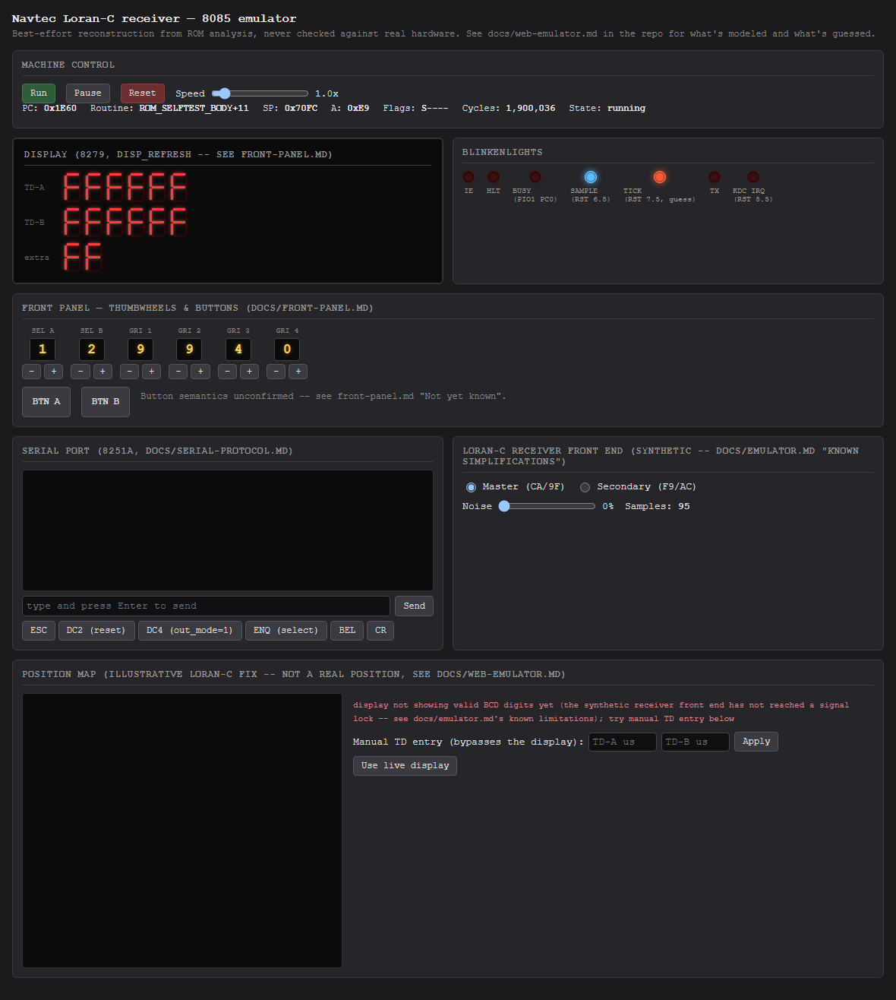
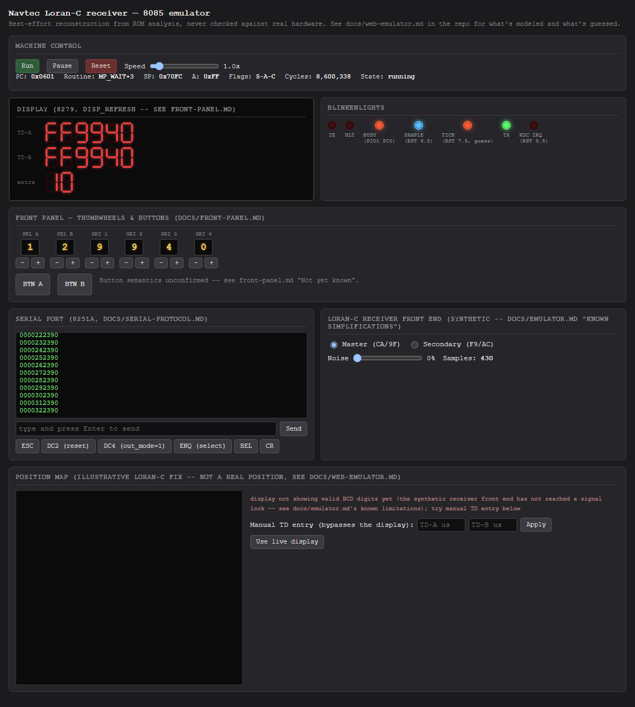

# Playbook: boot and display

## 1. Start the server

```sh
node src/emu/web-emu.js
```

Open `http://localhost:8085/`. The emulator has already been running since
the process started (there's no "load ROM" step - both images are loaded
at startup, see [emulator.md](../emulator.md)), and it boots with a valid
front-panel combination out of the box (selector A=1, B=2, GRI 9940), so
you land straight past `READ_SWITCHES`'s validation instead of the
switch-error retry loop.



At this point the CPU has usually only run for a fraction of a second -
you'll typically catch it early in `ROM_SELFTEST` or just past it, with the
display still showing whatever `DISP_REFRESH` last wrote (often all-`F`
from the 8279's power-up clear, or already mid-lamp-test).

## 2. Let it settle

Wait a couple of seconds. `ROM_SELFTEST` finishes, `READ_SWITCHES` passes,
and the firmware settles into its steady-state loop (`SERIAL_POLL` /
`WAIT_SAMPLE` / `MATCH_PULSES` / `TICK_TASK`, per
[emulator.md](../emulator.md)'s "What's been checked"). The classic
all-segments **88888888** lamp-test pattern often shows up first - that's
the firmware exercising every display segment, not a bug.



By this point the serial panel is showing `REPORT_TASK`'s periodic output
(see [serial-console.md](serial-console.md)), the blinkenlights panel shows
`BUSY`, `SAMPLE`, `TICK`, and `TX` active (see
[web-emulator.md](../web-emulator.md#whats-on-the-page) for what each one
means), and the display shows the TD-A/TD-B rows decoded from the 8279's
display RAM per [front-panel.md](../front-panel.md)'s byte layout.

## Reading the display

- **TD-A** / **TD-B**: six digits each, decoded from `displayRAM[0..5]`'s
  high/low nibbles respectively (see front-panel.md's table). A nibble of
  `A`-`F` still renders as *something* recognizable (a letter shape) rather
  than going blank, since the actual meaning of those values in this
  firmware isn't confirmed.
- **extra**: the two nibbles of `displayRAM[6]` - front-panel.md's own
  "Not yet known" section says its meaning (station letters? a lock
  indicator? part of the GRI?) isn't established.
