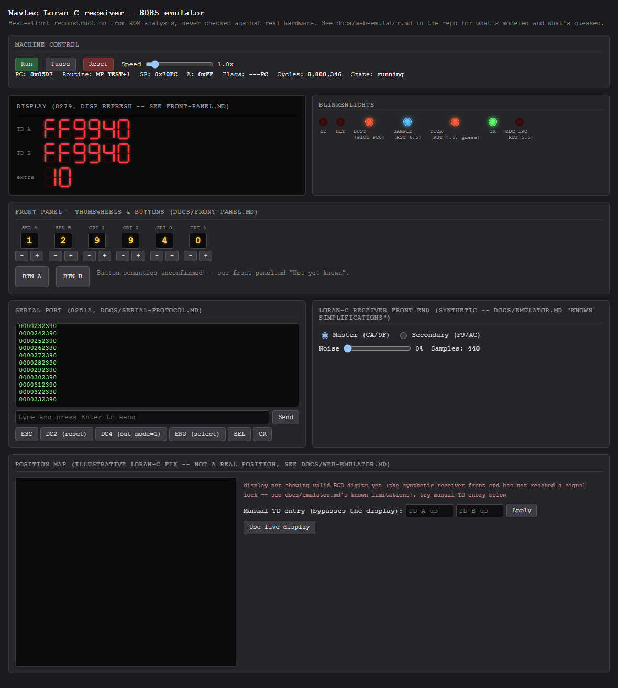
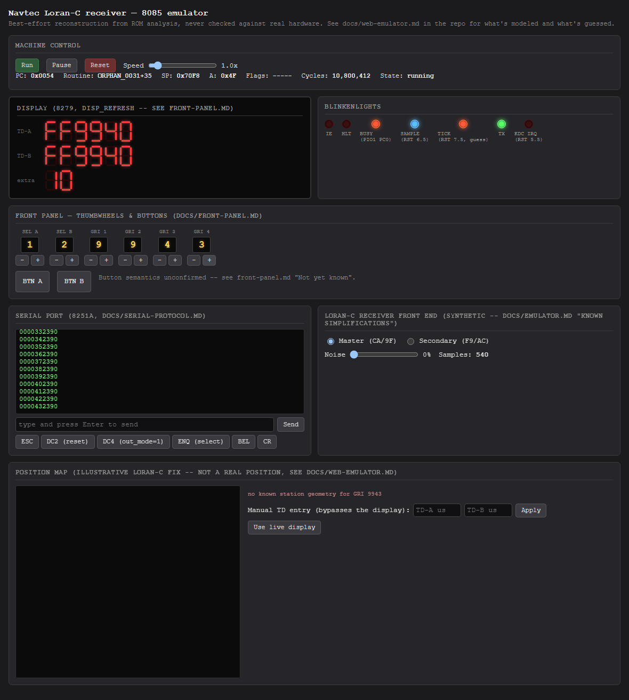
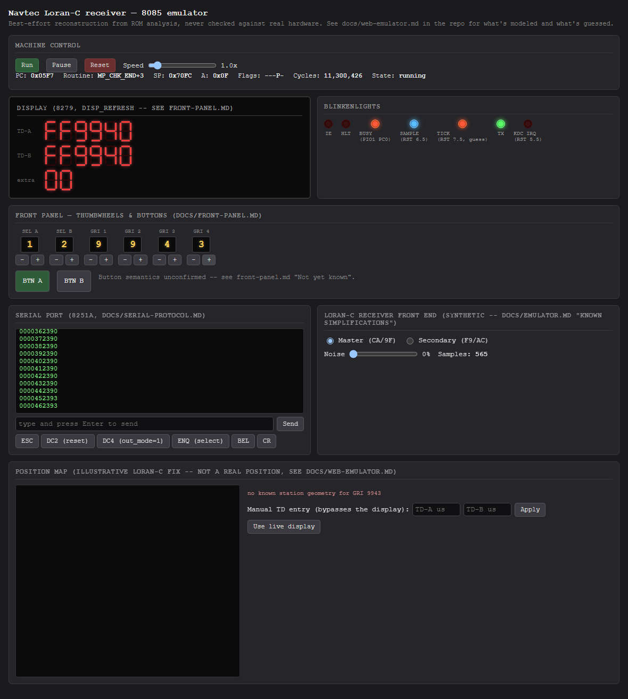

# Playbook: front-panel controls

Six thumbwheels and two push buttons, matching the sensor-matrix layout in
[front-panel.md](../front-panel.md).

## Thumbwheels

Each wheel shows its current digit (or `blank`) in a lit window, with `-`/`+`
steppers that cycle `0`-`9` then `blank`. This is this project's own UI
convention, not a claim about the physical control - front-panel.md's own
"Not yet known" section says nobody's confirmed which physical control maps
to which sensor row.

Clicking `GRI 4`'s `+` a few times steps it from `0` to `3`:

Every click does two things on the server: `bus.kdc.setSensorRow(...)`
(the new value) and `bus.kdc.raiseIrq()` (tells the CPU the switch matrix
changed). That second part matters - see
[web-emulator.md](../web-emulator.md#runtime-switch-changes-now-actually-work)
for why a change made after boot wouldn't have been noticed at all before
this feature was built, since nothing previously wired the 8279's IRQ
output to RST 5.5.

Changing `SEL A`/`SEL B`/`GRI 1`-`3` to something `READ_SWITCHES` rejects
(selectors must read `1`-`9`, GRI digit 1 must be `4`-`9`) will make the
firmware show its switch-error display instead of the normal TD readout -
that's the ROM's own documented validation behavior
(front-panel.md/rom-status.md), not an emulator bug.

## Push buttons

`BTN A` and `BTN B` are momentary (held while the mouse button is down,
matching a real pushbutton wired into the sensor matrix):

**What they actually do in the firmware is unconfirmed** -
front-panel.md's "Not yet known" section explicitly lists "the function of
the button edges" as an open question. The UI just exposes the two matrix
bits (row 6/7, bits 7 and 6) without claiming a function for them.
