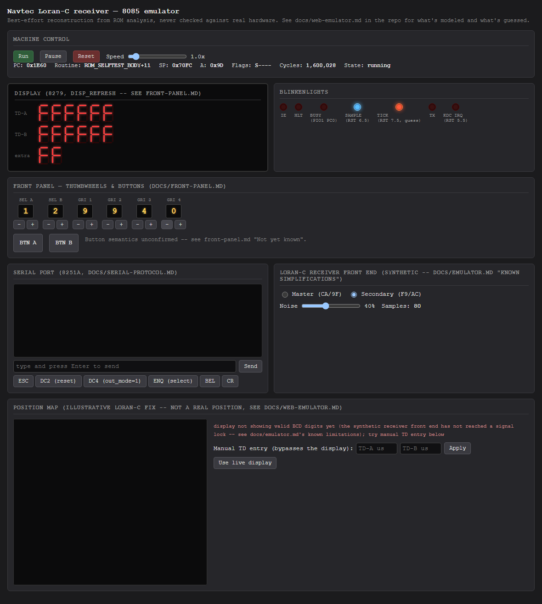
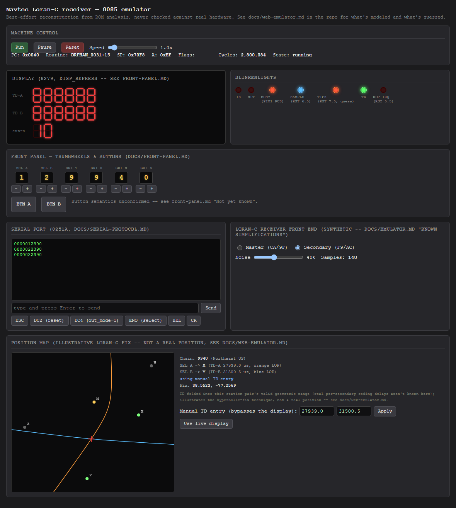

# Playbook: position map

**This is a demonstration of the hyperbolic-fix technique real Loran-C
receivers use, not a real position fix.** Read
[web-emulator.md](../web-emulator.md#position-map-illustrative-only) before
trusting anything this panel shows. Short version: the station coordinates
are real (chain 9940, "Northeast US" - Seneca NY master with Caribou ME /
Nantucket MA / Carolina Beach NC / Dana IN secondaries), and the
line-of-position math is the real, standard two-foci-hyperbola technique -
but the TD values driving it come from a synthetic receiver front end that
doesn't simulate real signal propagation, and no real per-secondary coding
delay is applied (none is known here), so there is no reason to expect the
computed "fix" to correspond to any real place a real receiver reading
those TDs would be.

## Why the live display usually won't drive this

The panel needs valid BCD digits on both TD-A and TD-B, which needs the
firmware to have actually locked onto (simulated) signals - and per
[receiver-front-end.md](receiver-front-end.md), this emulator's synthetic
front end hasn't been verified to get that far yet:

That "not available" message is the panel working correctly, not broken -
it's refusing to draw a fix from digits (`0xF`, not real BCD) that aren't
actually a TD reading.

## Manual TD entry

To see the math work, type values directly into the two TD fields and
click `Apply`. This bypasses the live display entirely - it's for
exploring the technique, not for reading the emulator's actual state:

With `SEL A` = 1 and `SEL B` = 2 (this playbook's dialed values, stored as
`2` and `3` per front-panel.md's "digit + 1" convention, mapping to
secondaries `X` and `Y`) and TD-A = `27939.0`, TD-B = `31500.5`
microseconds, the two colored lines are
each station pair's line of position (orange for master/X, blue for
master/Y), and the red crosshair is where they cross. Click `Use live
display` to go back to driving the panel from the firmware's own TD
readout.

## Reading the curves

- Yellow dot: the chain's master station.
- Green dots: the two secondaries currently selected by `SEL A`/`SEL B`.
- Grey dots: the chain's other secondaries (present for context, not used
  in this fix).
- Orange/blue curves: each secondary's line of position - literally "every
  point where `dist(P, master) - dist(P, secondary)` equals this TD,"
  which is the textbook definition of a hyperbola with foci at the two
  stations.
- Red crosshair: where the two LOPs intersect - the fix.

If the two curves don't cross within the visible area (or the numeric
solver doesn't converge), the panel says "LOPs did not intersect" instead
of drawing a misleading fix somewhere.
