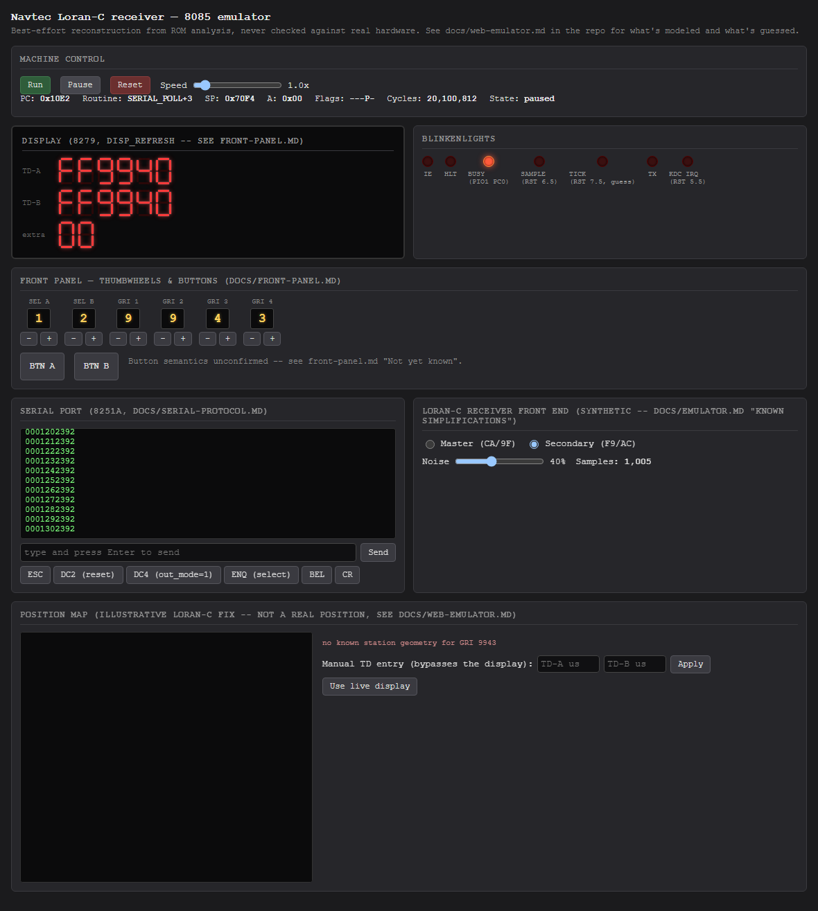
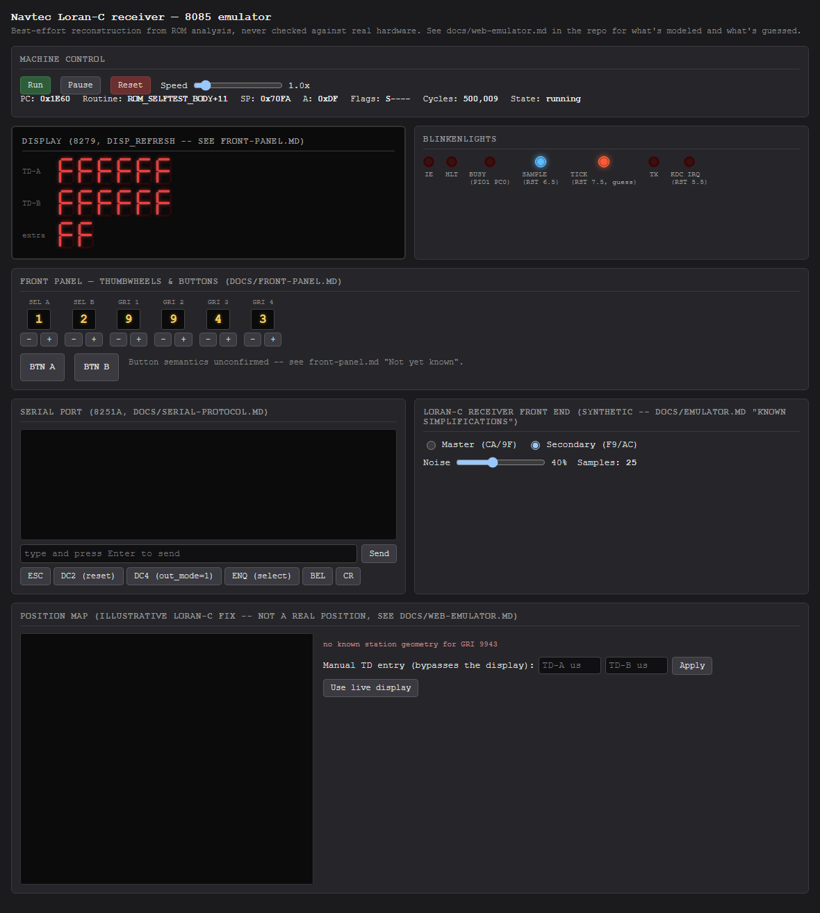

# Playbook: machine control

## Pause and resume

`Pause` freezes the emulator exactly where it is (the cycle counter stops
advancing); `Run` resumes from there. The 20ms run loop keeps ticking
either way - `Pause` just skips executing instructions during it, it
doesn't stop the Node process or the HTTP server.

The `Speed` slider (0.1x-10x) scales how many cycles the run loop targets
per 20ms tick, relative to the assumed 5 MHz clock - useful for slowing
things down to watch a specific transition, or speeding past the initial
self-test.

## Reset

`Reset` tears down and rebuilds the `Bus`/`Cpu8085`/`ReceiverFrontEnd`
from scratch - a real cold boot, not just a CPU register reset - and
immediately reapplies whatever the front-panel and receiver controls are
currently set to:

Notice `GRI 4` still reads `3` (changed earlier in
[front-panel-controls.md](front-panel-controls.md)), the receiver is still
in `Secondary` mode with noise, and the serial buffer is empty again -
reset clears the *machine's* state, not the *panel's*. If you want a truly
fresh start including the switches, dial them back manually first.
