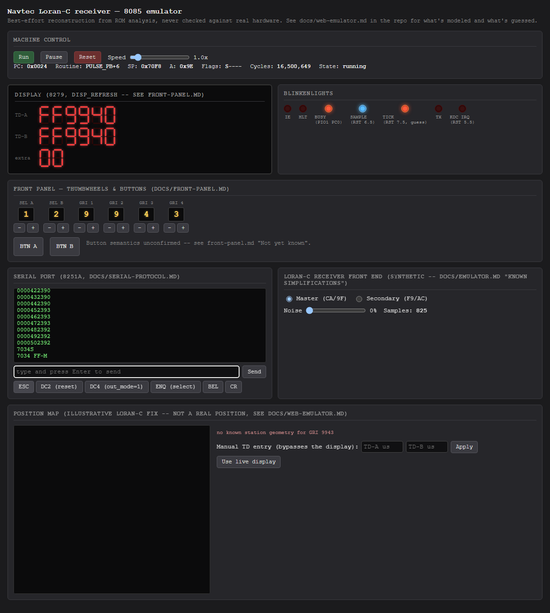
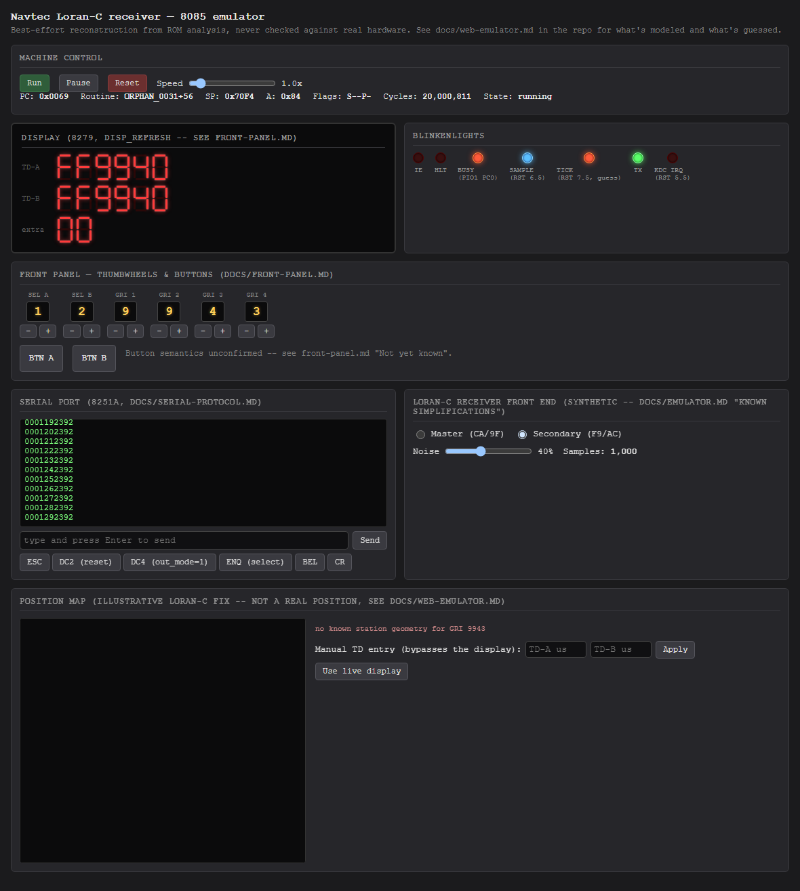

# Playbook: Loran-C receiver front end

The receiver panel controls the synthetic signal generator described in
[emulator.md](../emulator.md)'s "Known simplifications" -
`ReceiverFrontEnd` in `src/emu/emu8085.js` - not a real antenna.

## Default: clean master signal

`Master (CA/9F)` presents the master phase-code bytes hardware.md
documents (`0xCA`, `0x9F`); `Secondary (F9/AC)` switches to the secondary
codes (`0xF9`, `0xAC`) instead. `Samples` counts synthetic RST 6.5 strobes
since the emulator started (or last reset).

## Adding noise

The noise slider (0-100%) sets the per-bit flip probability applied to
each shifted-out phase-code byte (`ReceiverFrontEnd.applyNoise`) - useful
for exercising `QUAL_CHECK`'s rejection logic, which the clean default
signal never triggers:

Switching modes or noise takes effect on the *next* sample, not
mid-sample, so don't expect an instant visual change in the blinkenlights
panel - watch the `Samples` counter to confirm it's still running.

## What this can't show you

Per emulator.md, this front end has not been driven all the way to
`MASTER_FOUND` - the exact bit protocol `SHIFT_IN16`/`MATCH_PULSES`
expect hasn't been re-verified against the disassembly. In practice this
means the display's TD-A/TD-B digits usually stay in whatever pattern the
firmware shows before a real lock (see
[boot-and-display.md](boot-and-display.md)), rather than settling into a
genuine tracked TD reading you could feed into the
[position map](loran-position-fix.md).
