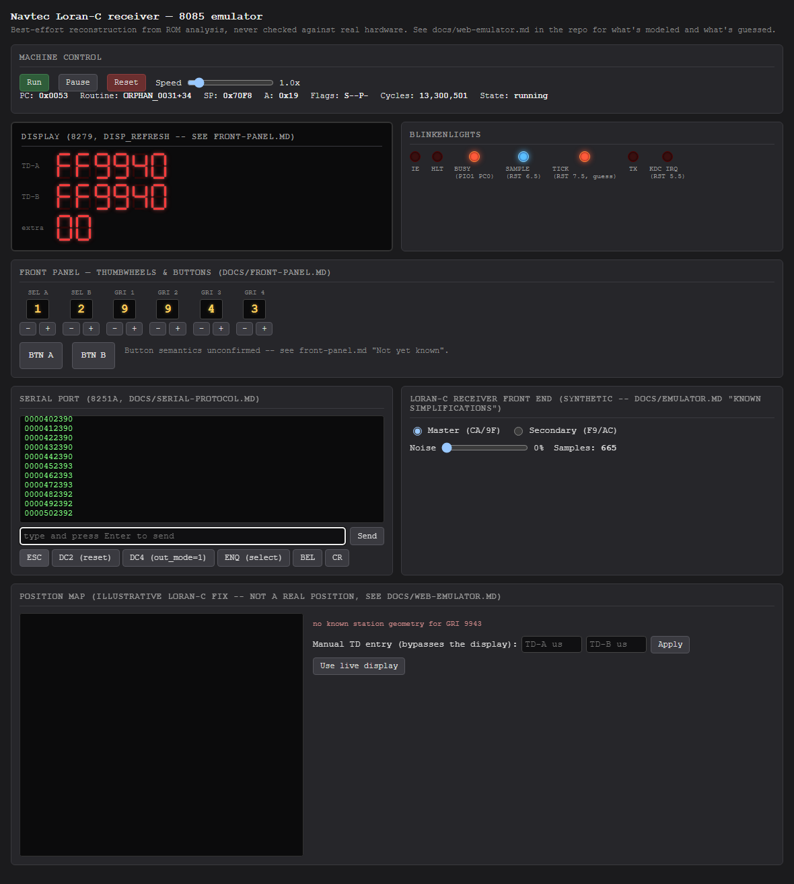
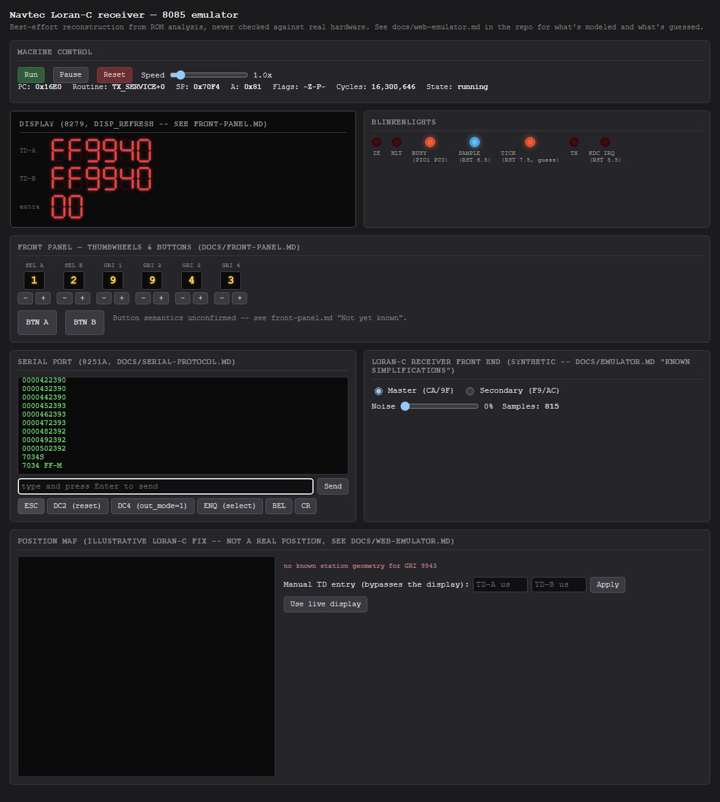

# Playbook: serial console

The serial panel shows everything the emulated 8251A has transmitted and
lets you send characters back, matching
[serial-protocol.md](../serial-protocol.md).

## Periodic reports

Once the firmware is past `READ_SWITCHES`, `REPORT_TASK` sends a line per
armed report item automatically - no input needed:

The quick-key buttons (`ESC`, `DC2`, `DC4`, `ENQ`, `BEL`, `CR`) send the
raw control characters serial-protocol.md's receive state machine expects,
since typing a literal `ESC` byte into a browser text box is otherwise
awkward. This screenshot was taken right after sending `ESC` then `,0`
(select unit `0` for the memory monitor) - the effect shows up a moment
later, once `SERIAL_POLL`'s next pass processes it.

## The firmware's own memory monitor

`ESC ,` `<UNIT_ID>` puts the addressed unit into monitor mode
(`PROTO_STATE` = 3), where every character is either a hex digit shifted
into `MON_WORD`, or one of the action characters in
serial-protocol.md's table. This example sets the pointer to `7034` (the
first byte of the TD-A record) and dumps memory from there - both
read-only, safe operations (deliberately avoiding `G`, which would `CALL`
whatever address happens to be in `MON_WORD`):

1. Type `7034S` and press Enter - `S` sets `MON_PTR = MON_WORD`.
2. Type `M` and press Enter - starts a memory dump from that pointer.

Per serial-protocol.md, `M` "prints bytes... one per pass, until a byte
repeats the previous value or the host sends a character" - so it keeps
going on its own; send `DC2` (`18`, the "reset" quick-key) to drop back out
of monitor mode when you're done, as the flow above does before moving on.
