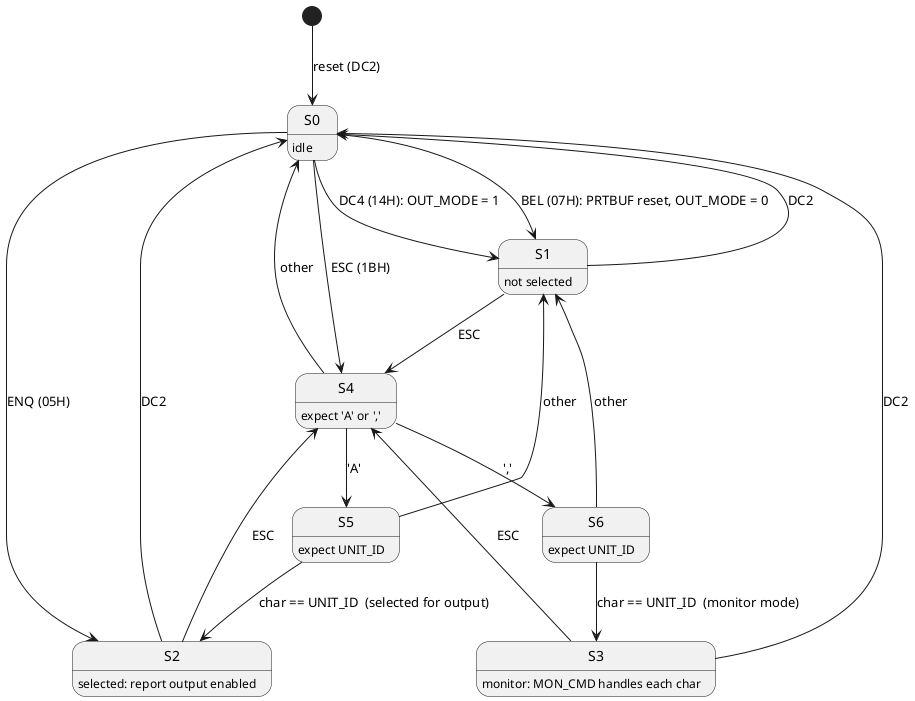
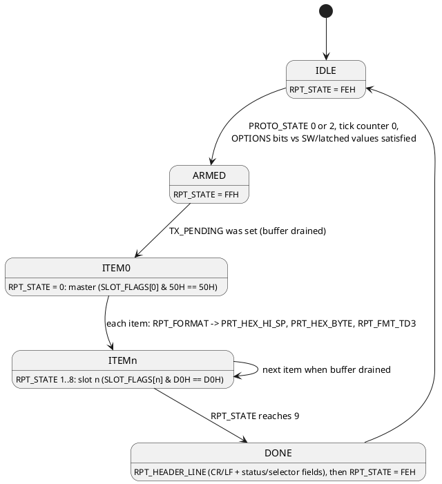

# Serial port protocol (8251 at C000/C001)

*For the host-facing flows this protocol supports (addressing a unit, the
memory monitor, periodic reports, plot mode), see
[user-flows.md](user-flows.md)'s "Flow F"; this document covers the
mechanism, that one covers the experience.*

Frame: asynchronous, 7 data bits, odd parity, 2 stop bits. Default 1200 baud,
selectable 110 / 300 / 1200 / 19200 from the front panel (see
[front-panel.md](front-panel.md)). RTS and DTR are asserted permanently. The
port is polled from the background loop; there is no serial interrupt.

Three things share the port:

1. a multi-drop selection protocol (`PROTO_STATE`) that lets a host address one
   unit by its `UNIT_ID` character;
2. a memory monitor (deposit, examine, dump, go) used when the unit is selected
   with the `,` form;
3. output: the periodic data report, the print buffer, and a strip-chart "plot"
   mode.

## Receive state machine

`SERIAL_POLL` (10DF) runs every background pass. `RX_STATE` (70E0) counts
characters within a transaction, `PROTO_STATE` (70DD) is the selection state.

Notes:

- `UNIT_ID` defaults to `'0'` and can be set from the thumbwheels (GRI digits 3
  and 4 as a hex byte while in set-up mode).
- DC2 (12H) resets both `PROTO_STATE` and `OUT_MODE`. DC4 (14H) sets
  `OUT_MODE` = 1, which stops `TX_SERVICE` from sending buffered output.
- `RPT_CHK_IDLE` only arms a report when `PROTO_STATE` is 0 or 2, so an
  addressed unit talks only after `ESC A <id>`.

## Monitor commands (PROTO_STATE = 3)

Every received character is echoed. Hex digits are shifted into the 16-bit
`MON_WORD`; the other characters act on it:

| Char | Action |
|---|---|
| `0`-`9`, `A`-`F` | `MON_WORD = (MON_WORD << 4) | digit`, set `MON_DIGIT_FLAG` |
| space | if a digit was entered, store low byte of `MON_WORD` at `(MON_PTR)`; then `MON_PTR++` |
| `R` | `MON_PTR--` (back up) |
| `S` | `MON_PTR = MON_WORD` (set address) |
| `G` | `CALL MON_WORD` (go) |
| `M` | dump memory: prints `-` then bytes as two hex digits each from `MON_PTR`, one per pass, until a byte repeats the previous value or the host sends a character |
| `K` | `OUT_MODE = 1` (suppress buffered output) |
| `P` | `OUT_MODE = 2` (plot mode) |
| `O` | `OUT_MODE = 0` (normal output) |

`TX_STATE_N` (1292) handles the multi-character replies: states 3..0B print the
echo, the two hex digits of a byte, or pointer bytes; state 0C..0E run the `M`
dump.

## Transmit paths

| Path | Routine | Condition |
|---|---|---|
| print buffer | `TX_SERVICE` (16E0) | `OUT_MODE` = 0, TxRDY, `TX_PENDING` clear; characters are pulled from `PRTBUF` downwards via `PRTBUF_GET` |
| monitor replies | `TX_STATE_N` | inside `SERIAL_POLL` |
| plot | `PLOT_OUT` (1358) | `OUT_MODE` = 2, once per pass when TxRDY |

### Plot mode

`PLOT_OUT` emits a strip chart, one text line per call cycle:

1. `PLOT_COL` = 80 ('P'): send CR.
2. `PLOT_COL` = 81 ('Q'): compute B and C with `PLOT_VALUES` (two scaled values
   3..66 derived from the current slot record), store as `PLOT_BASE`, send LF,
   reset the column.
3. Otherwise send a space, or `!` where the column equals B, `"` where it equals
   C, `#` where both coincide.

The result on a printing terminal is two traces across 80 columns.

### Periodic report

`REPORT_TASK` (1723) runs on every tick:

See [firmware.md](firmware.md)'s "Print-buffer formatting cluster" section for
the full byte-formatting detail (`PRTBUF_PUT`, `BYTE_TO_HEX2`, etc.), now fully
decoded.

`OPTIONS` (70DF) bits gate the report: bit 7 requires `RUN_TICK_SEC` low
nibble non-zero, bit 0 requires `RUN_TICK_SEC` non-zero, bit 1 requires
`SW_LO` low nibble, bit 2 requires `SW_LO`, bit 3 requires `SW_HI`.

**Corrected:** these were previously guessed to be "report only when the
operator has latched a value" conditions, on the theory that
`RUN_TICK_SEC`/`SW_LO`/`SW_HI` were static latched set-up values. They
aren't - `TICK_CLOCK_CASCADE` (see firmware.md) keeps `RUN_TICK_SEC`
free-running at all times (mod 60H, incrementing every RST 7.5 pass) and
cascades into `SW_LO`/`SW_HI` on overflow, so these bits mostly just
require "some nonzero time has elapsed since the last cascade wraparound"
- true almost continuously in practice, not a real "has the operator
configured this" gate. What these `OPTIONS` bits are actually meant to
select for is still an open question; it just isn't operator-latch state.

## Timing summary

| Item | Value |
|---|---|
| Character time at 1200 baud, 11-bit frame | 9.2 ms |
| Monitor `M` dump rate | one byte per background pass, paced by TxRDY |
| Report | one item per print-buffer drain, sequenced by the RST 7.5 tick |
