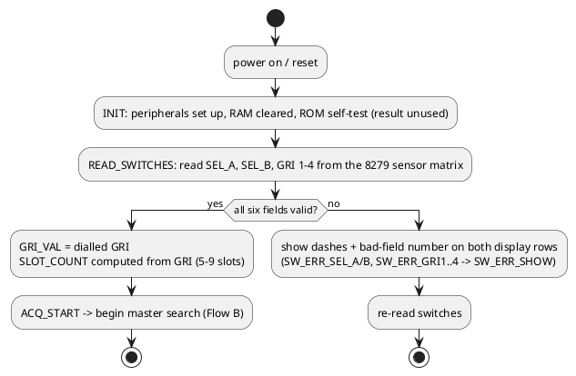
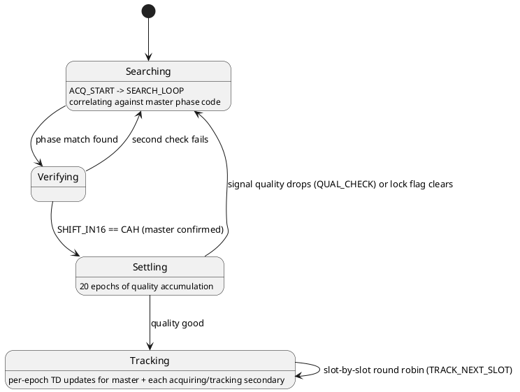
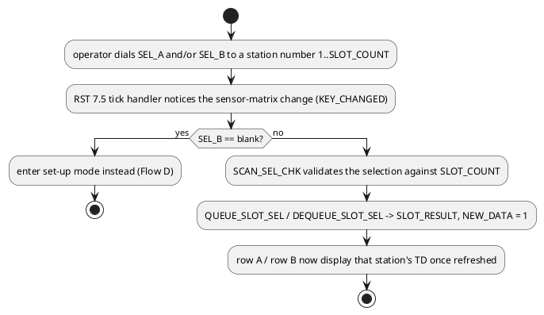
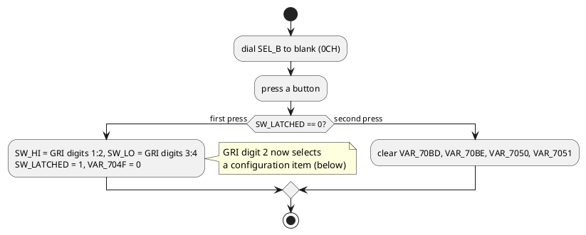
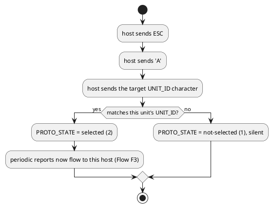
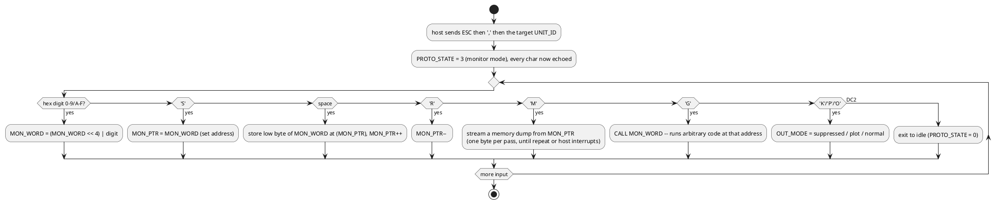
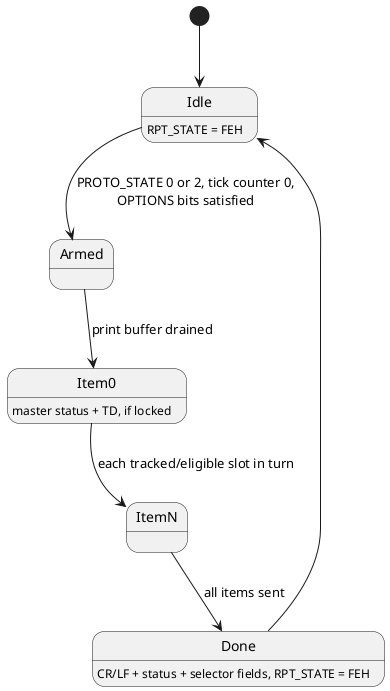

# Operator user-flow design document

This document reconstructs the **operator-facing user flows** of the Navtec
Loran-C receiver from the firmware's own logic - not the emulator's web UI
(see [emulator.md](emulator.md)/[web-emulator.md](web-emulator.md) for
that), but the flows the real 1979-era instrument was designed to present
to whoever stood in front of it, or talked to it over the serial port.
Every step below is derived from a specific routine, variable, or command
byte already decoded in [firmware.md](firmware.md),
[front-panel.md](front-panel.md), [serial-protocol.md](serial-protocol.md),
[hardware.md](hardware.md) and [ram-map.md](ram-map.md); each section cites
its source so this stays traceable back to the disassembly rather than
becoming a second, driftable copy of it.

**Confidence markers**, matching the rest of this project: **(confirmed)**
= directly evidenced by traced code paths; **(inferred)** = a reasonable
reading consistent with the code but not directly observable; **(open)** =
a real gap - the code doesn't say, and only the physical unit (or its
missing display/keypad panel - see hardware.md) could settle it.

## Actors and interaction surfaces

| Actor | Surface | Capability |
|---|---|---|
| Local operator | 6 thumbwheels + 2 push-buttons ([front-panel.md](front-panel.md)) | select stations, dial in a GRI, enter set-up mode |
| Local operator | 7-segment display, 2 rows x 6 digits + 1 extra byte | read TD values, station selection, error states |
| Remote host / printer | 8251A serial port, multi-drop, 7O2 framing ([serial-protocol.md](serial-protocol.md)) | address a unit, read periodic reports, run the memory monitor, receive a strip-chart plot |

There is no confirmed keyboard beyond the two push-buttons - "entry" is
exclusively by thumbwheel position, and the serial port's "monitor" mode is
a raw memory-inspection tool (deposit/examine/dump/go), not an
operator-level command language.

## Flow A: Cold start and switch validation

**(confirmed)** - firmware.md's boot sequence and "Switch-validation error
display" section, front-panel.md's validation rules. Validation rules,
verbatim from the code: selectors must read `1`-`9` after the "digit + 1"
encoding (raw thumbwheel `0`-`8`); GRI digit 1 must be `4`-`9` (Loran-C GRIs
run 4000-9999); digits 2-3 are unrestricted `0`-`9`; digit 4 may also be
blank (treated as `0`). Any failure shows dashes with the 1-indexed field
number stamped in the middle of *both* display rows and loops back to
re-reading - the operator's only feedback is "field N is wrong," not what
value would be acceptable.

**Try it:** [playbooks/front-panel-controls.md](playbooks/front-panel-controls.md)
demonstrates dialing an invalid combination and the resulting error display.

## Flow B: Acquisition and tracking (what the operator watches happen)

**(confirmed)** state machine, from firmware.md's "Main program phases"
(`ACQ_START`/`SEARCH_LOOP`/`SEARCH_VERIFY`/`MASTER_FOUND`/`SETTLE_LOOP`/
`TRACK_LOOP`). Once tracking, each of `SLOT_COUNT` time slots
independently cycles through its own smaller state machine
(search-window -> acquiring -> tracking, or miss/loss handling) - a
secondary can be acquiring while the master and other secondaries are
already tracking; the display doesn't distinguish this to the operator
(see "Display states" below) beyond whatever `SEL_A`/`SEL_B` currently
show.

**(open)** What appears on the display *during* this whole sequence -
while searching, settling, or waiting for a secondary to acquire - isn't
established. `DISP_REFRESH` writes whatever is currently in `DISP_ROW_A`/
`DISP_ROW_B` (7034-7039); nothing in the traced code path shows those cells
being written with a distinct "searching" or "acquiring" pattern. The
practical result (see [emulator.md](emulator.md)'s "What's been checked")
is the display often shows stale or lamp-test-pattern digits until a slot
actually has a real TD to report - this may be exactly what the real unit
does (blank/stale row = "not locked yet" is a defensible period-appropriate
UX choice) or may be a gap in this reconstruction. Settling it needs either
the physical unit or a receiver front end verified precisely enough to
reach a real `MASTER_FOUND` (see emulator.md's suggested next step).

## Flow C: Choosing what the display shows

Two independent mechanisms, both keyed off the same two selector wheels:

### C1: Picking a specific secondary per row (confirmed)

Source: front-panel.md's "Run-time switch handling" diagram,
`SEL_A`/`SEL_B` in ram-map.md ("selector wheel + 1"), `SEL_COL_TBL` /
`CHECK_SEL_RANGE` / `COMMIT_DISP_ROWS` in ram-map.md.

### C2: Auto-scan when SEL_B is blank (inferred)

`DISP_SCAN_SLOT`/`DISP_SCAN_START` (ram-map.md, 70B9-70BA) - "auto-rotating
slot index for the blank-`SEL_B` scan/cycle display mode" and
`DISP_SCAN_START` "snapshot... for wrap detection" - describe a display
mode that cycles through tracked slots automatically rather than showing a
single fixed secondary, for whenever the operator hasn't picked one. This
reads as a sensible complement to Flow D (SEL_B blank primarily arms
set-up mode via a button press; absent a button press, the display instead
shows all tracked stations in rotation) but the exact trigger condition and
cycle timing haven't been traced call-site by call-site the way Flow
D's set-up path has - **(open)**, worth a closer pass through the
`DISP_SCAN_*` call sites if this flow matters to you.

## Flow D: Set-up / configuration mode

Source: front-panel.md's "Run-time switch handling" diagram and
"Configuration items" table.

With `SEL_B` blank, GRI digit 1 blank as well selects "configuration item
by digit 2":

| GRI digit 2 | Effect |
|---|---|
| 0-3 | baud rate: 110 / 300 / 1200 / 19200 |
| 4 | `OPTIONS` = 00H |
| 5-9 | `OPTIONS` = 81H / 82H / 84H / 88H / 80H (report-gating bits) |

In every case, GRI digits 3-4 are simultaneously latched into `UNIT_ID` as
a hex byte (e.g. wheels `3,0` -> `'0'`, `4,1` -> `'A'`) - **(confirmed)**,
front-panel.md. This means baud rate/options selection and serial unit
addressing share the same four thumbwheels and can't be set independently
in one pass; changing just the baud rate also re-latches whatever `UNIT_ID`
the other two wheels currently show.

**(open)** `VAR_704F`/`SW_LO`/`SW_HI` are also cascaded as a live BCD
clock by `TICK_CLOCK_CASCADE` in normal run mode (firmware.md's
"unreconciled dual use") - so the same RAM cells that hold latched set-up
values apparently also tick like a clock once you leave set-up. Whether
that's intentional (e.g. a genuine time-of-day feature the display
occasionally shows) or a naming/reading mistake in this reconstruction
isn't settled.

## Flow E: Runtime error / recovery display

Any invalid switch state, at any time `READ_SWITCHES` (re-)runs, produces
the dash-plus-field-number pattern described in Flow A. This is the *only*
error surface for the local operator - there is no separate diagnostic
mode, alarm output, or fault log surfaced to the front panel; serial-side
diagnosis exists only via the memory monitor (Flow F2), which needs the
operator to know a specific address to inspect.

## Flow F: Remote / serial-host flows

The serial port is a multi-drop bus - many physical units can share one
line, each with its own `UNIT_ID`. A host must address a unit before it
responds selectively; **(confirmed)**, serial-protocol.md's state diagram.

### F1: Addressing a unit for output

### F2: Memory monitor session

**(confirmed)**, serial-protocol.md's monitor command table. This is a raw
hardware/firmware debug tool exposed on the production serial port, not an
operator feature - `G` in particular will execute whatever is at the given
address with no confirmation or safety check, which is worth knowing before
assuming every serial capability here is meant for routine operation.

### F3: Periodic report (the normal "just watch it" flow)

**(confirmed)**, serial-protocol.md. This is what a host or a printer
sitting on the line normally sees with no interaction at all beyond
addressing the unit once (Flow F1): a running log of TD readings, one line
per report cycle, gated by the `OPTIONS` bits Flow D's configuration items
set.

### F4: Plot mode (strip-chart output)

Sending `P` in monitor mode (or reaching `OUT_MODE` = 2 some other way)
switches to a two-trace ASCII strip chart instead of the tabular report -
**(confirmed)**, serial-protocol.md's "Plot mode" section. This is a
distinct *display format* for the same underlying TD data (Flow B/C's
tracked values), not a different data source.

**Try it:** [playbooks/serial-console.md](playbooks/serial-console.md)
walks through F1-F3 against the emulator (deliberately skips `G`, for the
reason F2 explains above).

## Display states, summarized

| Display shows | Produced by | Confidence |
|---|---|---|
| TD-A / TD-B, six digits each | `DISP_REFRESH` from `DISP_ROW_A`/`DISP_ROW_B` | confirmed (front-panel.md) |
| all-segments lamp/self-test pattern | `DISP_TEST_TICK`'s two-stage counter (ram-map.md `DISP_TEST_CNT1/2`) | inferred - matches classic 7-segment lamp-test convention, and is what the emulator actually shows early after boot |
| dashes + bad-field digit | `SW_ERR_SHOW` (Flow A/E) | confirmed |
| auto-cycling secondary TDs | `DISP_SCAN_SLOT` (Flow C2) | inferred, not call-site traced |
| blink-to-blank on a row | `BLINK_ROW_BLANK`, gated by `DISP_ROW_A_FLAG`/`DISP_ROW_B_FLAG` bit 7 | confirmed mechanism exists; trigger condition for *why* a row blinks isn't traced here |
| extra 2-digit/indicator field (byte 6, `703A`) | `DISP_REFRESH`'s 7th byte | open - meaning unknown, see front-panel.md's "Not yet known" |

## Open UX questions this document surfaces

Beyond what's individually flagged above:

1. **What do the two push-buttons mean outside set-up mode?**
   `RESTART_REQ = 2` is set on any button press outside set-up
   (front-panel.md), but "restart" of *what*, exactly, isn't traced past
   that flag being set.
2. **Is there a display-dimming control?** hardware.md's `PWR/DIM`
   connector suggests one exists physically, but no code path in this
   firmware addresses a brightness/dimming register - if it exists, it's
   likely analog (a potentiometer ahead of the display driver), not
   firmware-controlled.
3. **What does the operator see while acquisition is in progress?** Flow
   B's open question - the single biggest gap between "what the code does"
   and "what this document can say the operator perceives."

## Where each flow lives in the code

| Flow | Entry point(s) | Doc |
|---|---|---|
| A: cold start / validation | `READ_SWITCHES` (141F), `SW_ERR_*` (1990-19B7) | front-panel.md, firmware.md |
| B: acquisition/tracking | `ACQ_START` (012D) through `TRACK_LOOP` (021B) | firmware.md |
| C1: station selection | `SCAN_SEL_CHK`, `QUEUE_SLOT_SEL` (1DBD), `DEQUEUE_SLOT_SEL` (1E05) | front-panel.md |
| C2: auto-scan display | `DISP_SCAN_SLOT`/`DISP_SCAN_START` (70B9-70BA) | ram-map.md |
| D: set-up mode | front-panel.md's run-time diagram, `SW_LATCHED`/`SW_HI`/`SW_LO`/`UNIT_ID` | front-panel.md, ram-map.md |
| E: error display | `SW_ERR_SHOW` (19B8) | firmware.md |
| F1-F2: serial selection/monitor | `SERIAL_POLL` (10DF), `MON_CMD` (11EA) | serial-protocol.md |
| F3: periodic report | `REPORT_TASK` (1723) | serial-protocol.md |
| F4: plot mode | `PLOT_OUT` (1358) | serial-protocol.md |

This table is a map back to the primary sources, not a replacement for
them - when a flow's detail matters, read the cited routine's comment in
`disasm/nt3321-22.json` and its fuller writeup in the linked doc.
